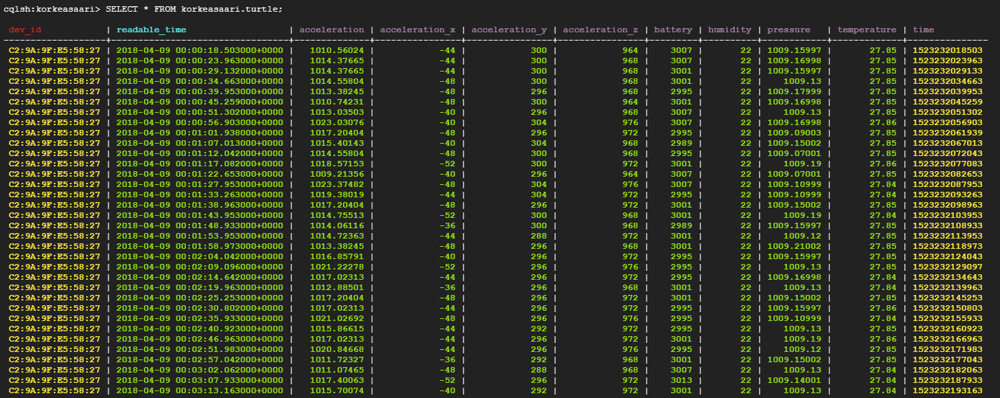

# 1. Set up Google Cloud Platform Virtual Machine
__*Note:*__ The original plan was to run three different virtual machines and implement mysimbdp-coredms, mysimbdp-dataingest, and mysimbdp-daas separately, but for simplicity and time constraints, it was decided to do everything on a single virtual machine.

Instructions for creating a virtual machine (VM) instance: https://cloud.google.com/compute/docs/instances/create-start-instance

When creating a VM, use the following parameters if possible:

- Boot dosk: **Ubuntu 22.04 LTS**, Size: **>40 GB**
- Machine configuration: Series:**E2**, Machine type: **e2-standard-4** 
- Firewall: Allow HTTP traffic

Open ssh-in-browser after you've created the VM instance.

# 2. Set up an assignment repository using GIT

Run the following commands in the root folder of the repository:

    git clone https://version.aalto.fi/gitlab/shahram-barai-projects/assignment-1-729983.git

# 3. Set up Docker and Docker Compose
__*Note:*__ Run all the commands in the root folder of the repository (*cd ~*):

We will use the __*docker_installer.sh*__ script to install Docker and Docker Compose, 
which I prepared in advance to speed up and simplify the preparation process.

First lets Set execute permission on your script using chmod command:

    sudo chmod +x ./assignment-1-729983/docker_installer.sh

Run script:

    sudo bash ./assignment-1-729983/docker_installer.sh

# 4. Set up 'mysimbdp-coredms' (Cassandra)

    cd assignment-1-729983/code/mysimbdp-coredms/
    sudo docker compose -f mysimbdp-coredms.yaml up -d

Let us inspect the IP addresses of our cluster as we will need to define our cluster in Python

    sudo docker exec -i -t node-1 bash -c 'nodetool status'

Output:

    Datacenter: datacenter1
    =======================
    Status=Up/Down
    |/ State=Normal/Leaving/Joining/Moving
    --  Address     Load        Tokens  Owns (effective)  Host ID                               Rack 
    UN  172.18.0.3  109.4 KiB   16      100.0%            407f0bd1-2f62-4247-a166-4295b28dc2d0  rack1
    UN  172.18.0.2  104.36 KiB  16      100.0%            18c0e737-d82d-406a-9d48-9291cfcee33d  rack1

__*Note:*__ *If your IP addresses are 172.18.0.2 and 172.18.0.3, you don't need to do anything; otherwise, copy it and save it to ~/code/mysimbdp-dataingest/kafka_concumer-cassandra_ingestion.py ->* __*CASSANDRA_IP_ADDRESS*__

    cd ~

Now we need to creat keayspace and table:
    
    docker exec -it node-1 bash -c 'cqlsh'

You are now inside the *sqlsh>*, type:

    CREATE KEYSPACE IF NOT EXISTS korkeasaari WITH REPLICATION = {'class' : 'SimpleStrategy', 'replication_factor' : 2};

    USE korkeasaari;

    CREATE TABLE IF NOT EXISTS turtle (
    time text,
    readable_time timestamp,
    acceleration float,
    acceleration_x int,
    acceleration_y int,
    acceleration_z int,
    battery int,
    humidity float,
    pressure float,
    temperature float,
    dev_id text,
    PRIMARY KEY (dev_id, readable_time));

You can stay here and check the table after running kafka consumer-cassandra ingestion.py and kafpa producer.py by using following command:

    SELECT * FROM korkeasaari.turtle;

# 5. Set up 'mysimbdp-dataingest' (Kafka)
You must now launch two new SSH browser windows (*Settings -> New Connection*).

Go to 'mysimbdp-dataingest' repository:

    cd assignment-1-729983/code/mysimbdp-dataingest/

Let's start by installing the Python requirements:

    sudo pip3 install -r requirements.txt

Run docker compose:

    sudo docker compose -f mysimbdp-dataingest.yaml up -d

Run the following command in the second SSH window:

    python3 kafka_consumer-cassandra_ingestion.py -t turtle -g kafka

Run the following command in the third SSH window:

    python3 kafka_producer.py -i ../../data/data.csv -c 10 -s 30 -t turtle

You should see the following after updating the table's *korkeasaari.turtle*:

