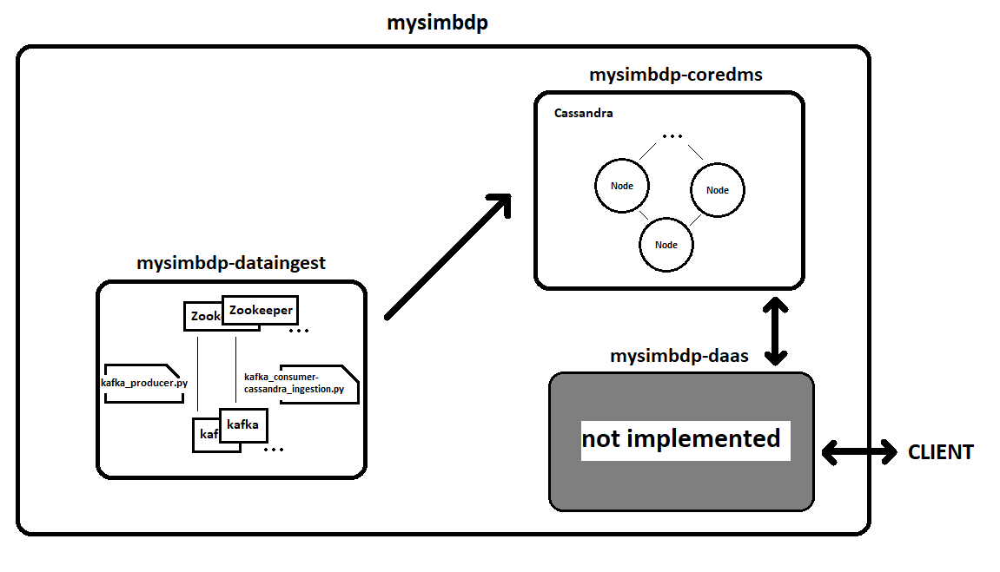

# Part 1 - Design

### 1. Explain your choice of the application domain and corresponding types of data to be supported and technologies for mysimbdp-coredms. Explain under which situations/assumptions, your platform serves for big data workload.
I decided to using turtle data from Korkeasaari Zoo, which is a time series of IoT data collected from RuuviTag devices.
The choice of using this data type was based on the interest to work with IoT and realtime data.
Time series data includes sensor readings such as acceleration, temperature, pressure, and humidity.
These data are available as separate CSV files, which can be accessed and downloaded from https://iot.fvh.fi/downloads/tortoise/ .
This is a common type of data in IoT and sensor networks, and can be quite large in volume.

In terms of technologies for mysimbdp-coredms, I have chosen Cassandra, which is a distributed NoSQL database designed for handling large amounts of data across multiple nodes.
This makes it a good choice for big data workloads, as it can scale horizontally to handle increasing volumes of data.
Additionally, Cassandra's flexible data model and built-in support for time-series data make it an excellent choice for managing the types of data seen in IoT and other real-time data applications.

Because I will be using data from IoT devices and real-time data, I must design the system to be scalable, fault-tolerant, and capable of handling massive volumes of data.
To achieve this, I am utilizing technology capable of handling dispersed data storage, processing, and analysis.
In addition, I must evaluate my system's performance and efficiency, as well as the security and privacy of my data. 
By designing my system to meet these specifications, it will be able to handle the demands of big data workloads while also providing valuable insights into the data I am collecting.

### 2. Design and explain the interactions among main platform components in your architecture of mysimbdp. Explain which would be the third parties (services/infrastructures) that you do not develop for your platform.
In this architecture, *Apache Cassandra* is used as the database to store the data, *Apache Kafka* is used as a message broker, and data ingestion is handled by two Python scripts, **"kafka_producer.py"** and **"kafka_consumer-cassandra_ingestion.py"**.

The **"kafka_producer.py"** script reads a large input file in chunks, processes each chunk of input data, and sends it to the Kafka topic specified as an argument using the *Confluent Kafka* Python client library. 
The data for each row in the chunk is converted to a JSON string and sent to Kafka using the *kafka_producer.produce()* method.
For emulation of streaming/realtime data, the *time.sleep()* method is used to introduce a delay before sending the next chunk.

The **kafka_consumer-cassandra_ingestion.py** script subscribes to the Kafka topic specified as an argument and consumes data from it using the Confluent Kafka Python client library. 
For each message received, the message data is parsed from the JSON string, and the *write_to_cassandra()* function is called to write the data to the Cassandra database. 
The *write_to_cassandra()* function takes the message data as an argument, prepares an INSERT statement, converts the timestamp to ISO 8601 format, and executes the INSERT statement with data from Kafka.

The diagram below depicts the architecture of my Big Data platform design. Each main components description and function is as follows:

- **mysimbdp-coredms** is a key component of the mysimbdp big data platform, responsible for storing and managing data. 
It is uses Apache Cassandra as its underlying database management system. 
Its main function is to store and manage data.
- **mysimbdp-dataingest** is a key component of the mysimbdp big data platform, responsible for reading data from external data sources and storing it in mysimbdp-coredms. 
It is uses Apache Kafka as its underlying messaging system to manage data ingestion. 
Its main function is to read and store data in mysimbdp-coredms.
- **mysimbdp-daas** (not implemented) provides APIs to external data producers/consumers for storing and retrieving data in/from mysimbdp-coredms, thereby acting as a bridge between them. 
It manages data authentication and authorization, as well as data transformation and quality checks.

The following are the interactions between the main platform components:
- **kafka_producer.py** sends the data to the Kafka topic specified as an argument.
- **kafka_consumer-cassandra_ingestion.py** subscribes to the Kafka topic specified as an argument and consumes data from it.
For each message received, the message data is parsed and passed to the *write_to_cassandra()* function.
- **write_to_cassandra()** prepares an INSERT statement and executes it with the data from the Kafka message.

Cassandra and Kafka are examples of third-party services/infrastructures that I am not developing for this platform.
These are open source software projects, such as the Python Confluent Kafka and Cassandra libraries, that make writing code for data platforms easier and faster.

### 3. Explain a configuration of a cluster of nodes for mysimbdp-coredms so that you prevent a singlepoint-of-failure problem for mysimbdp-coredms for your tenants.
To configure a cluster of nodes for mysimbdp-coredms to prevent single point of failure for tenants, we need to make sure that the cluster has at least two nodes running. 
This is because having two nodes provides redundancy, which means that if one node fails, another can take over its responsibilities.

    ...
    services:
      node1:
        ...
        environment:
          - CASSANDRA_SEEDS=node1,node2           # add node2 to seeds
         ...
      node2:
        ...
        environment:
          - CASSANDRA_SEEDS=node1,node2           # add node1 to seeds
    ...
        

If node1 fails, node2 can take over its responsibilities, and conversely. 
This ensures that the cluster will keep running even if one of the nodes fails.

### 4. Explain the level of replication in your design, how many nodes are needed in the deployment of mysimbdp-coredms for your choice so that this component can work property (e.g., the system still supports redundancy in the case of a failure of a node).
A replication factor of 3 is commonly used for a good balance between redundancy and resource utilization, requiring at least 3 nodes for proper functioning of mysimbdp-coredms.
A higher replication factor ensures greater redundancy and fault-tolerance but also requires more nodes in the system.
However, a lower replication factor may require fewer nodes but can increase the risk of data loss in the event of a node failure.
The exact number of nodes depends on the size and complexity of the system, as well as the workload and performance requirements of the application.

### 5. Explain how would you scale mysimbdp to allow many tenants using mysimbdp-dataingest to push data into mysimbdp.
To allow many tenants to use mysimbdp-dataingest to push data into my mysimbdp, I can consider scaling my Kafka cluster to accommodate the increased load. 
Here are three ways to scale a Kafka cluster:

- __Increase the number of brokers:__ as the number of tenants and data volume increases, I can add more Kafka brokers to the cluster to increase its capacity to handle incoming data. 
This will also help distribute the workload across the brokers, allowing for better resource consumption.
- __Increase the number of partitions:__ I can increase the partition number in Kafka for the topics that receive data from mysimbdp-dataingest. 
This will help in the distribution of data across more brokers, allowing for parallel processing and reducing latency.
- __Optimize Kafka configuration:__ by shoosing the correct values for Kafka parameters such as batch size, linger time, and buffer size

# Part 2 - Implementation

### 1. Design, implement and explain one example of the data schema/structure for a tenant whose data will be stored into mysimbdp-coredms.
Here is an example data schema/structure for Korkeasaari Zoo's (tenant's) IoT data that will be stored in mysimbdp-coredms:
        
    CREATE TABLE korkeasaari.turtle (
      time text,
      readable_time timestamp,
      acceleration float,
      acceleration_x int,
      acceleration_y int,
      acceleration_z int,
      battery int,
      humidity float,
      pressure float,
      temperature float,
      dev_id text,
      PRIMARY KEY (dev_id, readable_time)
    );

This table is designed to store data related to turtles that are being monitored using IoT devices. The table has the following fields:

- *time:* when data recorded
- *readable_time:* time recorded in human-readable format
- *acceleration:* turtle's movement
- *acceleration_x:* X-direction acceleration
- *acceleration_y:* Y-direction acceleration
- *acceleration_z:* Z-direction acceleration
- *battery:* device battery level
- *humidity:* turtle's environment moisture
- *pressure:* turtle's environment atmospheric pressure
- *temperature:* turtle's environment temperature
- *dev_id:* ID of the monitoring device

This data schema/structure is designed to efficiently store and retrieve IoT data from Korkeasaari Zoo, 
while also allowing for easy expansion to include additional columns or data sources as needed.

### 2. Given the data schema/structure of the tenant (Part 2, Point 1), design a strategy for data partitioning/sharding, explain the goal of the strategy (performance, data regulation and/or what), and explain your implementation for data partitioning/sharding together with your design for replication in Part 1, Point 4, in mysimbdp-coredms.
In this case, when designing a partitioning strategy, I aim to distribute my data among multiple nodes to enhance query performance and scalability. 
I typically divide my data into smaller partitions using a partition key and store each partition on a different node.
To implement this strategy in mysimbdp-coredms, I can create three partitions for each dev id and store each on a separate cluster node.

    CREATE KEYSPACE IF NOT EXISTS korkeasaari
      WITH REPLICATION = {
       'class' : 'SimpleStrategy',
       'replication_factor' : 3
    };

With a replication factor of 3, each partition will have three copies on three different nodes. 
This provides redundancy and fault tolerance in the event of node failure while maintaining data availability.

### 3 Assume that you are the tenant, write a mysimbdp-dataingest that takes data from your selected sources and stores the data into mysimbdp-coredms.
For mysimbdp-dataingest, as explained in *Part 1, Point 2*, I use two Python scripts (**kafka_producer.py** and **kafka_consumer-cassandra_ingestion.py**),
where first script reads data from a CSV file and sends it to a Kafka topic using a Kafka producer (emulat streaming/realtime data), 
and the second script reads data from the Kafka topic using a Kafka consumer and stores it in Cassandra.
#### 3.1 Explain what would be the atomic data element/unit to be stored.
The atomic data element/unit to be stored in Cassandra is a row of data, which consists of several fields, such as time, acceleration, battery, humidity, pressure, and temperature.
I have already implemented the schema of such a table in the *Part 2, Point 1*.
#### 3.2 Explain possible consistency options for writing data in your mysimdbpdataingest.
The following are some possible consistency options for writing data in your mysimbdp-dataingest:

- Data is sent to Kafka only once, with no guarantees of successful delivery. This is the Kafka producer's default setting. 
There is a risk of data loss in this case if the Kafka topic is unreachable or if there are errors during data transfer.
- Data is sent to Kafka with the expectation of at least one successful delivery. This can be done by setting the acks parameter in the Kafka producer to 'all'. 
If there are retries due to failures, data duplication may happen, but all data will eventually be delivered.
- Data is sent to Kafka with the guarantee that only one successful delivery may happen and no data will be duplicated.
This is possible with Kafka's idempotent producer feature.

# Part 3 - Extension

#### 1. Using your mysimdbp-coredms, a single tenant can create many different databases/datasets.Assume that you want to support the tenant to manage metadata about the databases/datasets, what types of metadata you would like to support? Can you provide one example of using the metadata to find a dataset?
Here's an example of metadata:
- Data ingestion time: timestamp of data ingestion
- Data source: where the data came from
- Data owner: who owns/responsible for the data
- Data quality metrics: metrics to ensure data quality
- Data processing information: information about data processing steps

Also in our case, you can track and record the hours when the turtle is most active and the percentage of activity per day.
Then divide the turtles into groups based on activity and keep track of those who are less active.

#### 2. Assume that each of your tenants/users will need a dedicated mysimbdp-coredms. Design the data schema of service information for mysimbdp-coredms that can be published into an existing registry (like ZooKeeper, consul or etcd) so that you can find information about which mysimbdp-coredms is for which tenants/users.
The service information data schema for each mysimbdp-coredms and its associated tenant can be saved in a registry such as ZooKeeper,
which enables centralized and secure configuration information management with distributed synchronization. 
Users can be connected to their respective mysimbdp-coredms by matching the client ID with its corresponding database.

### 3. Explain how you would change the implementation of mysimbdp-dataingest (in Part 2) to integrate a service discovery feature (no implementation is required).
Instead of hardcoding the connection information for mysimbdp-coredms (i.e., the Cassandra cluster's IP address and port), 
we can use a service discovery mechanism to retrieve the connection information dynamically at runtime.
The service discovery mechanism can then be implemented by storing information about each tenant's mysimbdp-coredms in ZooKeeper.

When mysimbdp-dataingest is launched, it can query the registry service for the connection information of the corresponding mysimbdp-coredms for the current tenant.
After obtaining the connection information, mysimbdp-dataingest can connect to Cassandra and store the data for the tenant.

### 4. Assume that now only mysimbdp-daas can read and write data into mysimbdp-coredms, how would you change your mysimbdp-dataingest (in Part 2) to work with mysimbdp-daas?
To use mysimbdp-daas, I would need to change mysimbdp-dataingest to send data to mysimbdp-daas rather than directly to mysimbdp-coredms.
This means I'll need to write a client-side script called mysimbdp-daas.py, which will be used instead of kafka-consumer-cassandra ingestion.py.
To send data to mysimbdp-coredms, the client-side script mysimbdp-daas.py would need to be modified to use the appropriate APIs. 
It's also critical to make sure it's set up correctly to handle the expected data volume and velocity.

The main difference between the previous and this scenario is that the client only knows the server address for ingestion and sends a request to this server, 
which connects to the database and reacts to the client.

### 5. Assume that you have both mysimbdp-daas and mysimbdp dataingest available for tenants/users write the data into mysimbdp coredms. Explain and provide pros and cons of deployment examples suggesting when a tenant/user should use mysimbdp-daas and mysimbdp-dataingest.
If both mysimbdp-daas and mysimbdp-dataingest are available for tenants/users to write data into mysimbdp-coredms, the choice of which component to use will depend on the specific use case and requirements of the tenant/user.

For example tenants/users with more complex data ingestion and storage requirements may prefer 
to use mysimbdp-dataingest for more direct control and customization of the data ingestion process. 
On the other hand, tenants/users with simpler requirements and less technical knowledge may prefer 
to use mysimbdp-daas for a simplified and more user-friendly data ingestion process.