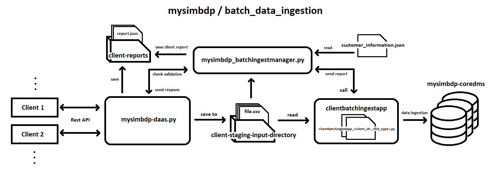
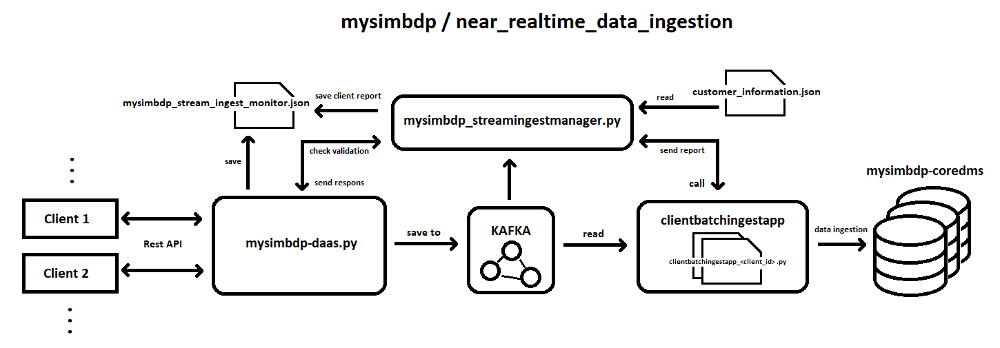

# Second Assignment - Working on Data Ingestion Pipelines

The goal of this assignment is to develop and manage data ingestion pipelines in big data platforms and to demonstrate an understanding of key issues of big data ingestion pipelines

### Directory structure:

- **_code_:** source code
- **_data_**: sample data that was used in the tests
- **_reports:_** include assignment report and deployment guid

### Architecture:

For more information about desing and technical issues, check **_Reports/Assignment_2_Report_.**
