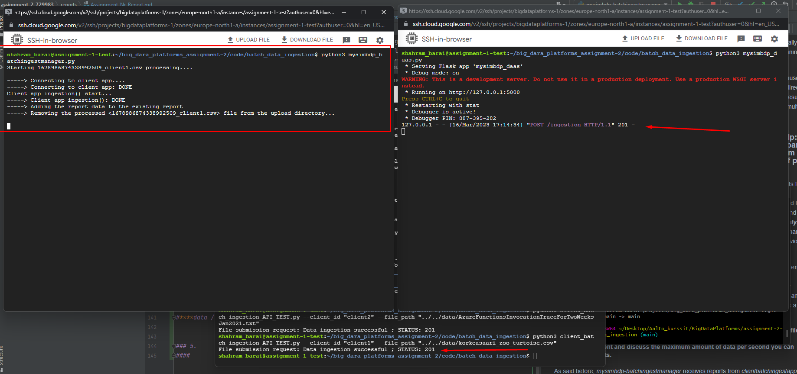
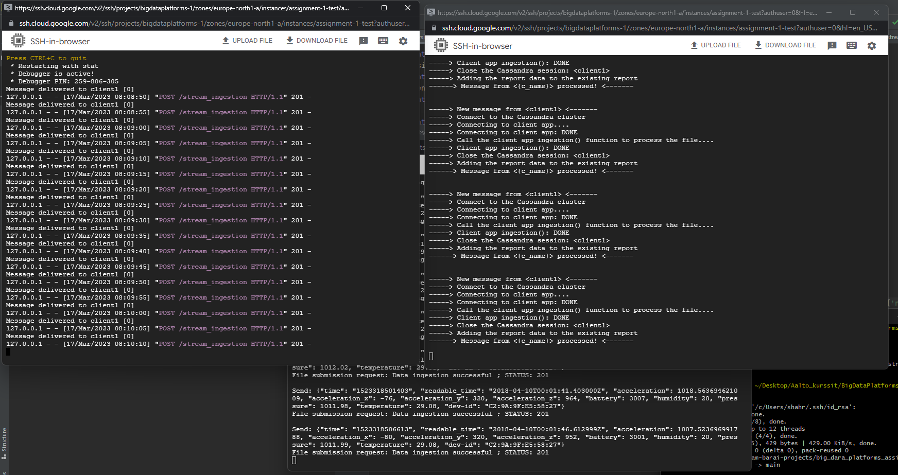

# 1. Set up Google Cloud Platform Virtual Machine
__*Note:*__ The original plan was to run three different virtual machines and implement mysimbdp-coredms, mysimbdp-dataingest, and mysimbdp-daas separately, but for simplicity and time constraints, it was decided to do everything on a single virtual machine.

Instructions for creating a virtual machine (VM) instance: https://cloud.google.com/compute/docs/instances/create-start-instance

When creating a VM, use the following parameters if possible:

- Boot dosk: **Ubuntu 22.04 LTS**, Size: **>40 GB**
- Machine configuration: Series:**E2**, Machine type: **e2-standard-4** 
- Firewall: Allow HTTP traffic

Open ssh-in-browser after you've created the VM instance. Preferably **_open 3 windows_** as same time (daas, manager 
and code for sending post request with file or data row)

# 2. Set up an assignment repository using GIT

Run the following commands in the root folder of the repository:

    git clone https://version.aalto.fi/gitlab/shahram-barai-projects/big_dara_platforms_assignment-2.git assignment-2-729983

# 3. Set up Python requirements, Docker and Docker Compose
__*Note:*__ Run all the commands in the root folder of the repository (*cd ~*):

We will use the __*docker_installer.sh*__ script to install Docker and Docker Compose, 
which I prepared in advance to speed up and simplify the preparation process.

First lets Set execute permission on our script using chmod command:

    sudo chmod +x ./assignment-2-729983/code/docker_installer.sh

Run script, it will install docker and docker compose (also install python3-pip):

    sudo bash ./assignment-2-729983/code/docker_installer.sh

Now we can install the Python requirements:

    sudo pip3 install -r ./assignment-2-729983/code/requirements.txt

# 4. Set up 'mysimbdp-coredms' (Cassandra) and 'mysimbdp-dataingest' (Kafka)

Set up Cassandra and Kafka clusters with docker compose (one by one!):

    sudo docker compose -f assignment-2-729983/code/mysimbdp-coredms/mysimbdp-coredms.yaml up -d

    sudo docker compose -f assignment-2-729983/code/mysimbdp-dataingest/mysimbdp-dataingest.yaml up -d

Let's inspect the IP addresses of our Cassandra cluster as we will need to define our cluster in Python

    sudo docker exec -i -t node-1 bash -c 'nodetool status'

Output:

    Datacenter: datacenter1
    =======================
    Status=Up/Down
    |/ State=Normal/Leaving/Joining/Moving
    --  Address     Load        Tokens  Owns (effective)  Host ID                               Rack 
    UN  172.18.0.3  109.4 KiB   16      100.0%            407f0bd1-2f62-4247-a166-4295b28dc2d0  rack1
    UN  172.18.0.2  104.36 KiB  16      100.0%            18c0e737-d82d-406a-9d48-9291cfcee33d  rack1

__*Note:*__ *If your IP addresses are 172.18.0.2 and 172.18.0.3, you don't need to do anything; otherwise, copy it and save it to ~/code/mysimbdp-dataingest/kafka_concumer-cassandra_ingestion.py ->* __*CASSANDRA_IP_ADDRESS*__

We need to create keyspace for our clients:
    
    sudo docker exec -it node-1 bash -c 'cqlsh'

Now we are inside the *sqlsh>*, type:

    CREATE KEYSPACE IF NOT EXISTS client1 WITH REPLICATION = {'class' : 'SimpleStrategy', 'replication_factor' : 2};
    CREATE KEYSPACE IF NOT EXISTS client2 WITH REPLICATION = {'class' : 'SimpleStrategy', 'replication_factor' : 2};

# 5. Set up and test 'batch_data_ingestion'

    cd assignment-2-729983/code/batch_data_ingestion/

Let's start by setting **_mysimbdp-daas_** to transfer data via API (local, of course :D):

    python3 mysimbdp_daas.py

Let's launch the **_mysimbdp_batchingestmanager_** in the second SSH-window:
    
    python3 mysimbdp_batchingestmanager.py

In the third window, we'll run the client code that sends post-requests:

Client 1 with csv file (1736.66 kB, 15679 rows):
    
    python3 client_batch_ingestion_API_TEST.py --client_id "client1" --file_path "../../data/korkeasaari_zoo_turtoise.csv"

Client 2 with txt file (291MB):

    python3 client_batch_ingestion_API_TEST.py --client_id "client2" --file_path "../../data/AzureFunctionsInvocationTraceForTwoWeeksJan2021.txt"

You can find the reports in the folder "assignment-2-729983/code/batch_data_ingestion/client-reports". For example:

    nano client-reports/client1_report.json

# 6. Set up and test 'near_realtime_data_ingestion'

    cd assignment-2-729983/code/near_realtime_data_ingestion/

Let's again start by setting **_mysimbdp-daas_** to transfer data via API (and again of course, local :D):

    python3 mysimbdp_daas.py

Let's launch the **_mysimbdp_streamingestmanager_** in the second SSH-window:
    
    python3 mysimbdp_streamingestmanager.py

In the third window, we'll run the client code that sends post-requests, same files:

Client 1 with csv file (1736.66 kB, 15679 rows), sending every data 5 second ('... -s 5'):
    
    python3 .\client_near_realtime_ingestion_API_TEST.py -id 'client1' -i '../../data/korkeasaari_zoo_turtoise.csv' -c 5 -s 5

Client 2 with txt file (291MB), sending every data 2 second ('... -s 5'):

    python3 .\client_near_realtime_ingestion_API_TEST.py -id 'client1' -i '../../data/AzureFunctionsInvocationTraceForTwoWeeksJan2021.txt' -c 5 -s 2

You can find the reports in the **_mysimbdp_stream_ingest_monitor.json_** , for example:

    nano mysimbdp_stream_ingest_monitor.json
