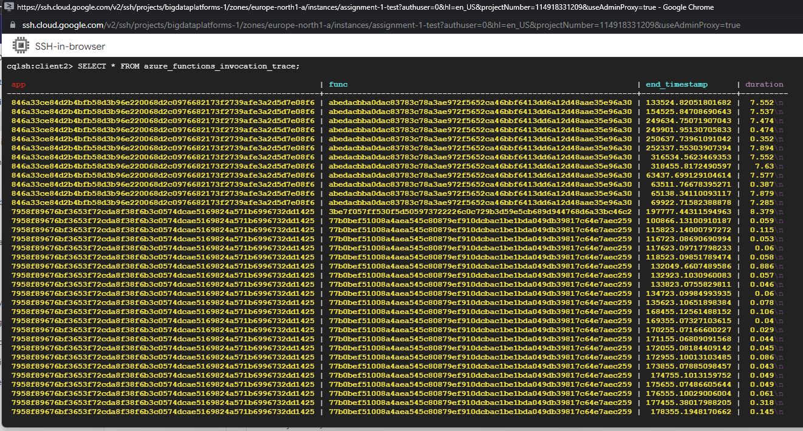
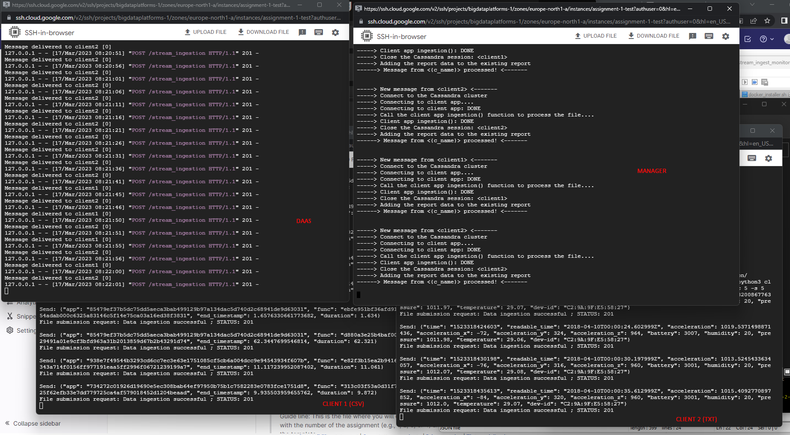
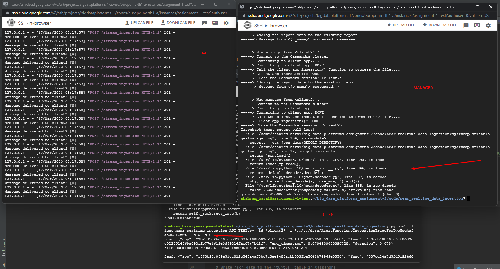

# Part 1 - Batch data ingestion pipeline

### 1. What constraints should be defined for files supported by mysimbdp's ingestion process and how can they be configured? Explain why you as a platform provider decide such constraints.

All ingestion constraints information by client IDs is stored in the ***customer_information.json*** file. 
In our example, the firstly defined ingestion constraint set for the clients are the file type, the maximum file size 
and the maximum number of files sent by the client via the API, and secondly the number of uploaded files, the total 
uploaded data size, and the allocated memory for the client in our DB.  

    <client_ID> : { "file_type", "max_files_number", "max_file_size", 
                    "uploaded_files_number", "uploaded_data_size", "max_memory_size", ... }

The file types that are supported for ingestion, will simplify data processing and increase platform security by 
limiting the upload of potentially malicious files. 
Limiting the maximum number of files that can be uploaded and processed at the same time (in our case, stored 
simultaneously in the _client-staging-input-directory_ folder) prevents users from accidentally or intentionally 
overloading the system with an excessive number of files, which will affect the platform's performance and stability. 
The maximum file size constraint keeps the platform efficient by preventing the upload of large files that may take a 
long time to process and consume an excessive amount of platform resources, also affecting the platform's performance 
and stability.

***customer_information.json*** file:

    {
      "client1": {
        "file_type": ["csv", "json"],
        "max_files_number": 5,
        "max_file_size": 104857600,
        "uploaded_files_number": 0,
        "uploaded_data_size": 0,
        "max_memory_size": 10737418240,
        "cassandra_class": "SimpleStrategy",
        "replication_factor": 3
      },
      "client2": {
        "file_type": ["txt"],
        "max_files_number": 2,
        "max_file_size": 524288000,
        "uploaded_files_number": 0,
        "uploaded_data_size": 0,
        "max_memory_size": 5368709120,
        "cassandra_class": "SimpleStrategy",
        "replication_factor": 2
      }
    }

In our example, we have specified that **_client1_** can send up to 5 CSV and/or JSON files at a same time with a maximum 
file size of up to 100MB and can store up to 10GB of data in database. 
**_client2_**, on the other hand, can only send up to two TXT files at the same time with a maximum file size of 500MB 
and can store up to 5GB of data in the database.

In this case, parameters such as _cassandra_class_ and _replacement_factor_ were not used to simplify and speed up the 
assignment main parts implementation, as there was little time left for testing and writing documentation. However, the 
idea is to store Cassandra parameters for each client, and then the batch manager create "keys" for clients based on 
the services we provided in storing his data in Cassandra. At the moment, the creation of keys for customers is 
implemented by manually entering line of code into the cassandra node.

### 2. As a tenant, explain the design of clientbatchingestapp and and provide one implementation.
#### Each tenant provides its ingestion programs/pipelines, clientbatchingestapp, which will take the tenant's files as input, in client-staging-input-directory, and ingest the files into mysimbdp-coredms. Any clientbatchingestapp must perform at least one type of data wrangling to transform data elements in files to another structure for ingestion.  Note that clientbatchingestapp follows the guideline of mysimbdp given in the next Point 3.

An example implementation of this task can be found in **_clientbatchingestapp_client1_csv.py_** (_code/batch_data_ingestion/_).

As a tenant, I would need to design my **clientbatchingestapp_<client_ID>_<file_type>.py** script to read my input files 
from the client-staging-input-directory and format them correctly for ingestion into the mysimbdp-coredms database
(write_to_cassandra()). I also need to make sure the table I'm loading the data into exists (create_table()) and create 
it if necessary.
I also need to return a report about data uploaded to Cassandra for capturing successful/failed ingestion as well as 
metrics about ingestion time, data size, etc., for files which have been ingested into mysimbdp. 

Below is an overview of the script functions that must be implemented:
    
- **create_table(session)**: Creates the table in the Cassandra my (client) keyspace if it does not already exist.
- **write_to_cassandra(session, data)**: Writes data from a file to the table in Cassandra. This function executes the 
INSERT statement with data from the file.
- **ingestion(session, file_path)**: Ingests data from a file into a Cassandra database. This function first calls the 
_create_table()_ function, then reads the file and writes each row to the table. Finally, it creates a report 
containing details of the ingestion process and returns it to _mysimbdp_batchingestmanager.py_.

**_'session'_** is a parameter that is passed to functions as an argument. It refers to an instance of the Cassandra 
session object, which is used to interact with a Cassandra database.

**_'file_path'_** is a string that represents the path to the client file that contains the data to be ingested into 
the Cassandra database.

### 3. Explain how mysimbdp-batchingestmanager knows the list of clientbatchingestapp and decides/schedules the execution of clientbatchingestapp for tenants.

The implementation of this question is done in file **_mysimbdp_batchingestmanager.py_** (_code/batch_data_ingestion/_).

The **_mysimbdp-batchingestmanager_** is a component designed to manage the ingestion of data files for clients within the 
mysimbdp system. Its primary function is to invoke the _clientbatchingestapp_ for each tenant and perform the ingestion 
of available files in the _client-staging-input-directory_.

Since the client sends its files via the rest API, I decided to verify the client during the post request in _mysimbdp-daas_ 
and return an HTTP response depending on checks for client and file information (_customer_information.json_). 
The **_BatchManager_** class is responsible for this process, which is located in _mysimbdp-batchingestmanager_. 
If all goes well, _mysimbdp-daas_ saves the client file to the _client-staging-input-directory_ folder, 
where _mysimbdp-batchingestmanager_ retrieves it for processing.

The _client-staging-input-directory_ folder is monitored by _mysimbdp-batchingestmanager_ in an infinite loop. When a 
client file is saved to the folder, _mysimbdp-batchingestmanager_ first extracts the _client_ID_ from the file name to 
identify the client and then calls the _clientbatchingestapp_ of that client. For security reasons, I decided to connect 
to the Cassandra cluster via mysimbdp-batchingestmanager and pass the client file path and Cassandra session object to 
the _clientbatchingestapp_ code, so there is no possibility of on client accidentally or purposefully change or delete 
data that belongs to another client.

_mysimbdp-batchingestmanager_ expects to receive a report from _clientbatchingestapp_, which it then writes to 
***code/batch_data_ingestion/client-reports/<clien_ID>_report.json***. Finally, the manager deletes the client file from the 
client-staging-input-directory folder before beginning to monitor for new files.

The file processing order is currently based on the arrival time of the post request. Because the file name consists of 
_time_ns_ + _client_id_, the files are stored in the client-staging-input-directory folder in the order of arrival, 
and the manager considers the one that arrived first. As a result, the files form a queue. This can be avoided in the 
future by dividing file processing among multiple _mysimbdp-batchingestmanager_'s.

### 4. Explain your design for the multi-tenancy model in mysimbdp: which parts of mysimbdp will be shared for all tenants, which parts will be dedicated for individual tenants so that you as a platform provider can add and remove tenants based on the principle of pay-per-use.

In a multi-tenant model, certain parts of the platform need to be shared among all tenants to enable consistency and 
avoid duplication of effort. These shared components include **_authentication and authorization_** (responsible for 
verifying the identity of each user and their associated permissions), **_platform infrastructure_** (components such 
as the database and networking), **_common functionalities_** (data validation, error handling, and logging), 
**_analytics and reporting_**, and **_basic UI components_** (login screens and navigation menus ). 
By sharing these components, the overall cost of the platform can be reduced, and consistent behavior can be ensured.

On the other hand, certain parts of _mysimbdp_ must be dedicated to individual tenants to ensure data and resource isolation. 
These dedicated components include tenant-specific data, configurations, authentication and authorization, and billing 
and payment information. By dedicating these parts of _mysimbdp_ for individual tenants, the platform provider can add 
and remove tenants without affecting other tenants. It also helps ensure that each tenant has a secure and isolated 
environment for their data and resources.

One of these tenant-specific data and configurations may be appropriate for some clients to select the strategy 
for storing data in the Cassandra cluster (**_cassandra_class_**) and the number of data replications per node 
(**_replication_factor_**).

#### Create test programs for customers (clientbatchingestapp), test data, and test profiles. Demonstrate examples in which data will not be ingested due to a violation of constraints. Present and discuss the maximum amount of data per second you can ingest in your tests. 

As said before, _mysimbdp-batchingestmanager_ receives reports from _clientbatchingestapp_ and stores them in 
***code/batch_data_ingestion/client-reports/<clien_ID>_report.json***, so that all relevant client report data can be 
found in the _client-report_ folder. Customer test profiles can also be found at 
***code/batch_data_ingestion/customer_information.json***.

During my tests on the GCP VM, I got the following write speeds (cassandra_class=SimpleStrategy, replication_factor=2):

_Client 1_ ingests a 1778337 bytes (**1736.66 kB**) _CSV_ file via API, and the result is:
- Processing time from the receipt of a post request to the completion of data upload to Cassandra: **~60.546 second**
- Manager processing time from receiving the file to calling _clientbatchingestapp_: **~0.162 second**
- uploading speed: ~29450.8 bytes/second (**28.7605 kB/s**) or ~260 row/second

    "1678986874338992509": {
      "file_received_size": 1778337,
      "file_name": "1678986874338992509_client1.csv",
      "file_path": "client-staging-input-directory/1678986874338992509_client1.csv",
      "ingest_start_time": 1678986874.5014064,
      "ingest_end_time": 1678986934.884765,
      "ingest_time": 60.38335847854614,
      "rows_total": 15679,
      "rows_ingested": 15678,
      "rows_failed": 1,
      "file_size": 1778337,
      "ingest_rate_bs": 29450.779897110773,
      "ingest_rate_rs": 259.6576340743064,
      "manager_process_time": 0.162413951,
      "total_process_time": 60.545772491 
    }

The problem I ran into while processing and uploading the _client 2_ file is that it takes a long time to upload to 
Cassandra. As a result, even after waiting 10 minutes, I don't have a report on _client 2_, but as you can see in the 
photo below, the data was still partially loaded.

We can try to solve the problem in the future by splitting the input file into **_micro-batches_**, which will be processed 
in stages or simultaneously, depending on the platform's capacity.

### 5. Implement and provide logging features for capturing successful/failed ingestion as well as metrics about ingestion time, data size, etc., for files which have been ingested into mysimbdp. 
#### Logging information must be stored in separate files, databases or a monitoring system for analytics of ingestion. Explain how mysimbdp could use such logging information. Show and explain simple statistical data extracted from logs for individual tenants and for the whole platform with your tests.

As explained before, this question is implemented in the _mysimbdp-batchingestmanager.py_ component, which receives 
reporting and ingestion statistics from the customer app _clientbatchingestapp__<client_ID>__<file_type>.py_ and stores them in 
***code/batch_data_ingestion/client-reports/<clien_ID>_report.json***, so that all relevant client report data can be 
found in the _client-report_ folder.

At the moment, my report implementation includes the following information:

- _file_received_size_: The size of the received file in bytes.
- _file_name_: The name of the received file.
- _file_path_: The path to the received file in the client staging input directory.
- _ingest_start_time_: The timestamp of when the ingestion process started in second.
- _ingest_end_time_: The timestamp of when the ingestion process ended in second.
- _ingest_time_: The time it took to ingest the file in seconds.
- _rows_total_: The total number of rows in the file.
- _rows_ingested_: The number of rows successfully ingested.
- _rows_failed_: The number of rows that failed to ingest.
- _file_size_: The size of the ingested file in bytes.
- _ingest_rate_bs_: The ingestion rate in bytes per second.
- _ingest_rate_rs_: The ingestion rate in rows per second.
- _manager_process_time_: The time it took for the manager process to complete in seconds.
- _total_process_time_: The total time it took for the ingestion process to complete in seconds.

Also, HTTP responses to clients when checking files during the "post request," which are currently just sent to the 
client at the time the problem occurs, would be useful in the future to save foreheads in a separate file.

The BatchManager **_class check_client()_** function returns a tuple with two values. A string indicating the check's outcome, which can be one of the following:

- **_'Client not found in customer data'_**: if the client ID is not found in the customer data.
- **_'File type not allowed for client'_**: if the file type is not allowed for the client.
- **_'File size exceeds maximum allowed size: <file_size>/<max_file_size>':_** if the file size exceeds the maximum allowed size for the client.
- **_'Maximum number of files uploaded'_**: if the maximum number of files has been uploaded by the client.
- **_'There is not enough memory on the client disk for the file.'_**: if there is not enough memory on the client disk for the file.
- '**_OK'_**: if the checks passed successfully.

And an integer indicating the HTTP status code to be returned in the HTTP response, which can be one of the following:

- **_403_**: if the client ID is not found in the customer data or the file type is not allowed for the client.
- **_405_**: if the file size exceeds the maximum allowed size for the client, the maximum number of files has been uploaded by the client, or there is not enough memory on the client disk for the file.
- **_201_**: if the checks passed successfully.

Such logging information could be used by mysimbdp to monitor the performance and health of their data ingestion pipeline. 
The logs can be processed and analyzed to identify patterns and trends in the data being ingested, such as file size and 
format, file rate, and any errors or issues that are occurring. This information can be used to optimize the data ingestion 
process, identify bottlenecks, and improve overall system performance.

For example, if the ingestion rate is consistently slower than expected, the logs could be used to identify the source 
of the bottleneck, such as a slow network connection or a poorly optimized data processing algorithm. Similarly, 
if errors are occurring frequently, the logs could be used to identify the root cause of the problem, such as data 
formatting issues or data corruption.

# Part 2 - Near-realtime data ingestion

### 1. For near-realtime ingestion, explain your design for the multi-tenancy model in mysimbdp: which parts of the mysimbdp will be shared for all tenants, which parts will be dedicated for individual tenants so that mysimbdp can add and remove tenants based on the principle of pay-per-use.

All files and the code implementation can be found in the _code/near_realtime_data_ingestion_ folder.

The basic idea behind mysimbdp's multi-user model for near-realtime data ingestion is similar to what I 
described in Part 1, point 4 for batch data ingestion, so I won't repeat myself, as the text can be found above.

The logic and implementation of stream ingestion method mostli is similar to batch ingestion, during the post request, 
verify the client, return an HTTP response based on client and file information checks, call the client ingestapp 
to process incoming data, and assemble & save report. Instead of storing data in a folder, we send it to Kafka and extract 
messages from it and send it to client-ingestapp.

### 2. Design and implement a component mysimbdp-streamingestmanager, which can start and stop clientstreamingestapp instances on-demand. mysimbdp imposes the model that clientstreamingestapp has to follow so that mysimbdp-streamingestmanager can invoke clientstreamingestapp as a blackbox, explain the model.

The implementation of this question is done in file **_mysimbdp_streamingestmanager.py_** (_code/near_realtime_data_ingestion/_). 

The StreamManager class, like the batch manager, is in charge of managing the ingestion process for each client by 
checking various constraints such as maximum file size, available disk space, ingestion speed, and etc (**_customer_information.json_**). 
If all goes well, mysimbdp-daas send the client data to the Kafka, where mysimbdp-batchingestmanager retrieves it for processing.

The main function starts by connecting to the Kafka bootstrap server and subscribing to multiple Kafka topics 
(in this case, client1 and client2). Then, it continuously reads messages from Kafka using the poll() method, 
waiting for one second to receive messages. If a message is received, it is processed by parsing the received JSON data 
and opening a connection to the corresponding Cassandra cluster.

The ingestion process is then transferred to the client app module for that specific client by calling the ingestion() 
function and passing the Cassandra session and the parsed JSON data as arguments. When the ingestion is finished, 
the Cassandra session is closed, and the ingestion report is added to the client's existing reports data. 
After that, the new report is added to the report data file.

This process continues indefinitely until the program is interrupted, at which point the Kafka consumer and Cassandra 
cluster connections are closed.

### 3. Develop test ingestion programs (clientstreamingestapp), which must include one type of data wrangling (transforming the received message to a new structure). 
#### Show the performance of ingestion tests, including failures and exceptions, for at least 2 different tenants in your test environment, explain also the data used for testing. What is the maximum throughput of the ingestion in your tests?

The implementation of the question can be found in the _code/near_realtime_data_ingestion/_ folder as 
**_clientstreamingestapp_clent1.py_** and **_clientstreamingestapp_clent2.py_**. _**mysimbdp_stream_ingest_monitor.json**_ file also
can be found in _code/near_realtime_data_ingestion/_ folder

For testing, I use two data files: korkeasaari zoo turtoise.CSV (1736.66 kB) data from IoT sensors on Korkeasaari 
island and AzureFunctionsInvocationTraceForTwoWeeksJan2021.txt (291MB) data from Azure functions invocation trace.
To achieve the streaming effect, both were read in chunks and sent via API to Daas with a defined period (10s, 5s, 1s, 0s).

The data we collected and saved to the _mysimbdp_stream_ingest_monitor.json_ file during the tests.

    {
        "client1": {
            "max_data_size": 1048576,
            "max_memory_size": 10737418240,
            "max_ingest_speed_bs": 10,
            "uploaded_data_size": 1045,
            "number_of_received_messages": 0,
            "average_ingestion_time": -1672481755.488265,
            "number_of_ingested_messages": 95,
            "last_ingest_time": 1679040507.5144699,
            "receive_time": 1679041415.9661214,
            "ingest_end_time": 1679040507.5144699,
            "ingest_file_size": 11,
            "ingest_rate_bs": 2019.5817027796018
        },
        "client2": {
            "max_data_size": 524288,
            "max_memory_size": 5368709120,
            "max_ingest_speed_bs": 10,
            "uploaded_data_size": 3968,
            "number_of_received_messages": 42,
            "average_ingestion_time": 839520711.044296,
            "number_of_ingested_messages": 992,
            "last_ingest_time": 1679041416.8092475,
            "receive_time": 1679041416.788592,
            "ingest_end_time": 1679041416.8092475,
            "ingest_file_size": 4,
            "ingest_rate_bs": 968.6055077651406
        }
    }

Also included are screenshots of the SHH windows demonstrating the operation of _mysimbdp-daas.py_, 
_mysimbdp_streamingestmanager.py_, and _client_near_realtime_ingestion_API_TEST.py_.

The manager also crashed when there is a very short delay between sending files (~0s). 
This happened several times throughout the tests and only when there was a very high speed of sending data.

### 4. clientstreamingestapp decides to report the its processing rate, including average ingestion time, total ingestion data size, and number of messages to mysimbdp-streamingestmonitor within a pre-defined period of time. Design the report format and explain possible components, flows and the mechanism for reporting

The implementation of this question is located in **_clientstreamingestapp_<client_id>.by_**.

As previously stated, the client app will send us a report that the manager can use in the future. 
The following is an example of implementation:

    # Create a report containing details of the ingestion process
        report = {
            'ingest_end_time': end_time,
            'ingest_file_size': len(json_data),
            'ingest_rate_bs':  len(json_data) / (end_time - start_time)
        }

As you can see, there isn't a lot of data here, because the report on the client's data is compiled from the moment he 
first arrived on our platform. The first parameters we adjust in mysimbdp-daas is receive time.

    @app.route('/stream_ingestion', methods=['POST'])
    def stream_ingestion():
        receive_time = time.time()
        ....

    -----------------------------------------------------------------------------------

    !!! mysimbdp-daas -> StreamManager -> streamingest() !!!
        ....
        # update customer data
        self.customer_info[client_id]['number_of_ingested_messages'] += 1
        self.customer_info[client_id]['uploaded_data_size'] = new_uploaded_data_size
        update_json_data(self.customer_info_file, self.customer_info)

        return 'OK', 201

Also, the manager, after receiving a report from the client app, adds two new data to the report and then saves it 
to mysimbdp_stream_ingest_monitor.json.

    # Add total and manager process time to client report
        reports[c_name]['average_ingestion_time'] = (float(reports[c_name]['average_ingestion_time']) + float(reports[c_name]['receive_time']) - float(reports[c_name]['last_ingest_time'])) / 2
        reports[c_name]['last_ingest_time'] = reports[c_name]['ingest_end_time']

In mysimbdp_stream_ingest_monitor.json, each client is represented as a nested dictionary with the following variables:

- max_data_size: maximum size of the data that the client is allowed to upload.
- max_memory_size: maximum amount of memory that the client can use to ingest data.
- max_ingest_speed_bs: maximum ingestion speed in bytes/second that the client is allowed to upload data.
- uploaded_data_size: total amount of data that has been uploaded by the client.
- number_of_received_messages: total number of messages received by the client.
- average_ingestion_time: average time in seconds it takes for the client to ingest a message.
- number_of_ingested_messages: total number of messages that have been ingested by the client.
- last_ingest_time: time of the last message ingested by the client.
- receive_time: time when client data arrived at our platform.
- ingest_end_time: times of when the last message was ingested by the client app to Cassandra.
- ingest_file_size: size of the message ingested to Cassandra.
- ingest_rate_bs: ingestion rate in bytes/second of the last message ingested by the client.

As discussed before, these variables can be used to monitor the boot performance of each client and enforce restrictions 
on their boot behavior to ensure resource efficiency and prevent system overload.

### 5.  Implement a feature in mysimbdp-streamingestmonitor to receive the report from clientstreamingestapp. Based on the report from clientstreamingestapp, when the performance is below a threshold, e.g., average ingestion time is too low, mysimbdp-streamingestmonitor decides to inform mysimbdp-streamingestmanager about the situation. Implementation a feature in mysimbdp-streamingestmanager to receive information informed by mysimbdp-streamingestmonitor.

**_mysimbdp-streamingestmonitor,_** in my implementation, is simple json file that stores the manager and app client's report data. 
It was decided to leave it like that due to a lack of time. I can imagine _mysimbdp-streamingestmonitor_ as a function in mysimbdp streamingestmanager.py that, based on the 
_clientstreamingestapp_ report, decides to notify _mysimbdp-streamingestmanager_ when performance falls below a threshold, 
e.g. average load time is too short.

However, for the time being, it only stores data from reports. More information about its parameters and structure 
can be found in the preceding section.

