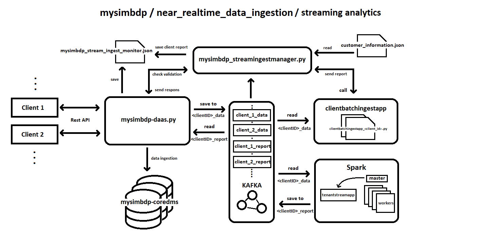

# Third assignment - Stream and Batch Processing

## Part 1 - Design for streaming analytics

### 1. As a tenant, select a dataset suitable for streaming data analytics as a running scenario. Explain the dataset and why the dataset is suitable for streaming data analytics in your scenario.
As a tenant, I would like to use the same dataset that was used as an example in Assinments 1 and 2 - IoT data from turtles 
monitored by devices at Korkeasaari Zoo. This dataset is suitable for streaming data analytics because it contains 
continuous data generated by IoT devices, which can be analyzed in real-time to gain insights into the turtles' behavior 
and health.

The dataset has the following fields:

- *time:* when data recorded
- *readable_time:* time recorded in human-readable format
- *acceleration:* turtle's movement
- *acceleration_x:* X-direction acceleration
- *acceleration_y:* Y-direction acceleration
- *acceleration_z:* Z-direction acceleration
- *battery:* device battery level
- *humidity:* turtle's environment moisture
- *pressure:* turtle's environment atmospheric pressure
- *temperature:* turtle's environment temperature
- *dev_id:* ID of the monitoring device

IoT is a good fit for streaming data analytics because it generates a large volume of data in real-time, which can be 
analyzed as it is generated. This makes it possible to gain insights and take action based on the data in near-real-time. 
IoT devices are fitted with sensors that continuously collect data and can be used to monitor a variety of physical and 
environmental conditions, including temperature, humidity, pressure, acceleration, and more. These devices can generate 
data at a high rate and volume, making it necessary to analyze the data in real-time to avoid information overload. 
By analyzing the data in real-time, insights can be gained quickly, enabling rapid decision-making and action.

#### As a tenant, present at least two different analytics in the interest of the tenant: _(i)_ a streaming analytics (tenantstreamapp) which analyzes streaming data from the tenant and _(ii)_ a batch analytics, using the workflow model, which analyzes historical results outputted by the streaming analytics.

_**(i)**_ 
One possible streaming analytics application for this dataset would be to monitor the turtles' activity patterns, 
such as their movement and acceleration, in order to detect any abnormal behavior or health issues. For example, if a 
turtle is not moving as much as it should, it may be sick or injured. This streaming analytics application can assist 
zookeepers in quickly identifying and addressing any health issues before they worsen.

Another possible streaming analytics application would be to monitor the turtles' environmental conditions, such as 
humidity, pressure, and temperature. If any of these factors exceed a certain threshold, it may indicate that the 
turtles are not in an appropriate environment and should be relocated or have their enclosure adjusted. This streaming 
analytics application can assist zookeepers in keeping the turtles in a healthy and comfortable environment.

_**(ii)**_ 
For batch analytics, we can use the historical data collected by the streaming analytics to gain deeper 
insights into the behavior and health of the turtles. For example, batch analytics can be used to identify seasonal 
changes in the turtles' behavior or health, or to track the overall health and well-being of the turtles over time. 
This batch analytics can also help the zookeepers to make more informed decisions about the turtles' care and well-being.

A tenant can also perform predictive maintenance on their devices to determine when it is likely to fail. 
Streaming analytics can be used to monitor the sensors' real-time status _(i)_, while the batch analytics can be used 
to analyze historical data in order to identify patterns in sensor/device failures. When the two are combined, 
a tenant can predict when a device is likely to fail and schedule maintenance before it happens.

### 2. The tenant will send data through a messaging system, which provides stream data sources. Discuss, explain and give examples for the following aspects for the streaming analytics: (i) should the streaming analytics handle keyed or non-keyed data streams for the tenant data, and (ii) which types of delivery guarantees should be suitable for the stream analytics and why.

_**(i)**_
The decision to handle keyed or non-keyed data streams for the tenant data in streaming analytics depends on the specific 
use case and the requirements of the tenant. Keyed streams are useful when we need to group data by a key (for example 
in our case, the device ID) in order to perform operations on it. Non-keyed streams, on the other hand, treat each 
incoming data point as a separate event and can be useful when performing stateless operations like filtering or mapping.

But generally handling keyed data streams in streaming analytics can be more convenient than non-keyed data streams.
Keyed streams are organized by a key, which means that all events with the same key are processed together, allowing for 
easier management of the order and organization of the data. In contrast, non-keyed streams do not have any specific 
organization or order, which can lead to complications in analysis and processing.

Keyed streams also allow for more flexibility in the types of operations that can be performed on the data, such as 
windowing and aggregation. On keyed data streams, these operations are generally more efficient because they can be 
performed on subsets of the stream with the same key rather than the entire stream.

In the case of our tenant's data (_the Korkeasaari Zoo's IoT data_), we can use keyed data streams to group the data by 
device ID (_**dev_id**_) if the tenant needs to analyze the data based on specific devices. For example, if the 
client wants to compare the temperature readings of different devices or track the acceleration of each device over time, 
we could use the device ID as a key to group the data by device and perform our analysis.

However, if tenant analysis does not depend on device-specific information, then we may not need to use a keyed data 
stream. For example, if tenant wants to calculate the average temperature or humidity across all devices, then a 
non-keyed stream may be sufficient.

_**(ii)**_
The types of delivery guarantees suitable for stream analytics are determined by the tenant's needs and the importance 
of the data being analyzed. For messages sent through the broker, Kafka provides different delivery guarantees. 
These guarantees are useful for ensuring that messages are processed in the correct order and without loss by the 
stream processing application. Spark supports Kafka message processing in at-most-once, at-least-once and exactly-once 
semantics.

**_At-least-once_** delivery ensures that all messages are processed but there may be duplicates. This is useful when 
duplicates can be tolerated in the application. **_At-most-once_** delivery ensures that messages are not duplicated but 
there may be some loss of messages. This is useful when message loss can be tolerated. Finally, **_exactly-once_** delivery 
ensures that each message is processed once and only once, but can be more complex to implement and may have 
performance overhead.

In the case of _Korkeasaari Zoo's IoT data_, for example, if the tenant is interested in real-time monitoring of turtle 
behavior, _at-least-once_ delivery may be appropriate, as it is critical to capture as much data as possible. However, 
if the tenant is analyzing historical data and accuracy is more important, then _exactly-once_ delivery may be more 
suitable, as it ensures that there are no duplicate or missing records.

### 3. Explain the following aspects and give examples: 
#### (i) which types of time should be associated with stream data sources for the analytics and be considered in stream processing (if the data sources have no timestamps associated with events, then what would be your solution)
The time associated with the stream sources can be of various types.
One of the most common types of time associated with stream sources is event time, which is the time when the 
event or data point was generated or occurred. In our case (_the Korkeasaari Zoo's IoT data_), there is a column called 
"**_readable_time_**" that represents the time the data point was generated in the real world and can be used as a timestamp for 
the event time.
But in th case, when the data sources have no timestamps associated with events or in other cases, we can use ingestion 
time, which is the time when the event or data point was sent from the device to the platform, and it can be used to 
track the performance metrics associated with the stream processing, such as latency or throughput.
Also, another option is to use processing time, which means that the system will use the time when the event or data 
point was received by the platform as its timestamp, but this may not always be the most accurate representation of the 
event time, especially if there are delays or network latency in transmitting the data.

#### (ii) which types of windows should be developed for the analytics (if no window, then why)
Depending on the type of analytics wanted, we can use or avoid using windows, which are used to group events in stream 
processing. In our case (_the Korkeasaari Zoo's IoT data_), we could use sliding windows to calculate various aggregates 
such as moving averages, maximum and minimum values, etc. For example, we could use a sliding window of 5 minutes with 
a slide interval of 1 minute to calculate the average temperature and humidity for every 1 minute (example below). 
But if real-time processing is more critical than analysis over time, we need avoid using windows. For instance, 
if we are monitoring a live event, we might want to quickly identify anomalies or patterns as they occur.

    ...
    .groupBy(window('readable_time', '60 seconds'), 'dev-id') \
    .agg({'temperature': 'avg', 'acceleration': 'avg', 'humidity': 'avg', 'pressure': 'avg', ...
    ...

#### (iii) what could cause out-of-order data/records with your selected data in your running example
One of the challenges in working with streaming data is dealing with out-of-order data, where the events are not 
delivered to the system in the order they were generated. Dealing with out-of-order data is critical in stream 
processing because it can significantly impact analysis results accuracy. Out-of-order data in Korkeasaari Zoo's 
IoT data can be caused by a variety of factors, including network delays, system issues, and device malfunctions, 
such as event overlapping when events overlap with each other in time. 
It can cause the stream processor to receive data out of order.
To address this issue, several techniques can be used, such as buffering, watermarking, and time windows.

#### (iv) will watermarks be needed or not, explain why
In stream processing, a watermark is used to determine when to trigger windowing operations.
It is an operation that groups data into fixed or sliding windows and performs calculations in each window. 
In other words, watermark is used to determine when a window can be closed and its contents can be processed. 

In _Korkeasaari Zoo's IoT data_, for example, if the sensor generates data every minute, a watermark at a specific 
timestamp can be set to ensure that all data generated before that time has arrived. This method prevents the system 
from computing aggregates for incomplete data, which can result in inaccurate results.

    # group the data by device ID and a 1-minute window
    parsed_df \
        .withWatermark("readable_time", "60 seconds") \
        .groupBy(window('readable_time', '60 seconds'), 'dev-id') \
        ...

### 4. Explain which performance metrics would be important for the streaming analytics for your tenant cases.
There are several performance metrics that are important for the streaming analytics of _Korkeasaari Zoo's IoT data_,
such as latency, throughput and error rate. By measuring these metrics, we can optimize the system or better 
performance and ensure that it meets the needs of its users.

_Latency_ is the time between an event occurs and when it is processed by the system. In the context of our tenant 
data, latency is important because it measures how quickly the system can respond to events and take appropriate action.
To measure latency, we can use timestamping on the events and compare the processing time to the event timestamp.

_Throughput_ is the rate at which events are processed by the system. It is important to measure the throughput of the 
system in order to understand its capacity and to ensure that it can handle the expected volume of events. To measure 
throughput, we can count the number of events processed over a period of time.

_The error rate_ is the percentage of events that are not correctly processed by the system. The error rate must be 
measured in order to identify and address any system issues that may be causing errors. To calculate the error rate, 
we can count the number of events that are incorrectly processed and compare it to the total number of events.

The file **_./code/stream processing/src/tenantstreamapp.py_** contains examples of how these metrics are implemented 
in code.

### 5. Provide a design of your architecture for the streaming analytics service and clarify the main components.

As you can see in the diagram above, _mysimbdp_ platform receives data from clients via HTTP requests that are sent to 
our RESTful API endpoint. At the moment we expect that the client will send data as JSON, but in the future we may add 
some different formats like XML and others.

The client sends data to our platform via the API by HTTP requests, as shown in the diagram above.
The **_client_streaming_ingestion_test.py_** script is used to simulate data streaming from devices in real time with a set 
period. The script reads a large input file in chunks, processes each chunk of input data, and updates the metrics with 
the correct sending time in place of the outdated "_time_" and "_readable_time_"information. The data for each row in 
the chunk is converted to a JSON string and sent to _mysimbdp-daas.py_** using the _requests.post()_ method. 
For emulation of streaming/realtime data, the time.sleep() method is used to introduce a delay before sending 
the next data row.

When data comes in through the API to **_mysimbdp-daas.py_**, it will return an HTTP response based on checking the 
customer information in the _customer_information.json_ file. We are using Flask for Python to process and analyze 
this data in real-time. The BatchManager class, located in**_mysimbdp-batchingestmanager_** and called by 
_mysimbdp-daas_, is responsible for the verification process. The BatchManager class **_check_client()_** function 
returns a tuple with two values: _message_ and _HTTP status code_. A string indicating the check's outcome, 
which can be one of the following:

- **_'Client not found in customer data'_**, **_403_**: if the client ID is not found in the customer data.
- **_'File type not allowed for client'_**, **_403_**: if the file type is not allowed for the client.
- **_'File size exceeds maximum allowed size: <file_size>/<max_file_size>'_**, **_405_**:  if the file size exceeds the maximum allowed size for the client.
- **_'Maximum number of files uploaded'_**, **_405_**: if the maximum number of files has been uploaded by the client.
- **_'There is not enough memory on the client disk for the file.'_**, **_405_**: if there is not enough memory on the client disk for the file.
- **_'OK'_**, **_201_**: if the checks passed successfully.

If everything goes well during the verification process, _mysimbdp-daas_ will send the client streaming data to the 
**_Kafka_** **'<client_ID>_data'** topic, where it can be read for analytics and written to the database.

The decision to choose Apache Kafka as the messaging system was because its architecture is based on the distributed 
commit log concept, which ensures high throughput and low latency. 
Kafka is scalable and can be distributed across multiple nodes, allowing it to handle large volumes of data and support 
multiple applications that require real-time data consumption and production. Kafka also provides fault-tolerance and 
high availability by replicating data across multiple brokers. It is compatible with wide range of programming languages 
and technologies, including Apache Spark.

The use of Spark for streaming analytics is a good fit for our needs because we are utilizing a sliding window to 
perform various aggregations on the data. This approach introduces a natural delay in the processing of the data, 
which means that real-time processing is not essential. Instead, we can use Spark's micro-batching approach to process 
the data in near-real-time intervals that still meet our needs for data analysis and reporting. Also, Spark is a scalable,
fault-tolerant, and high performance processing engine that make it great choice for handle large volumes of data.

The Spark streaming application **<client_ID>_tenantstreamapp.py** is responsible for reading data from Kafka 
topic and parsing the received data to extract the relevant fields for analysis. The Spark worker nodes then perform 
the required transformations and aggregations on the data over a time window to generate the desired analytics output,
which will be then written to the Kafka topic "**<client_ID>_report**".

In the end, to make processed data available to the tenant in real-time, we are using a RESTful API that retrieves the 
data from Kafka and present it in json format. The tenant could then make API requests to retrieve the result in 
real-time.

## Part 2 - Implementation of streaming analytics

### 1. As a tenant, implement a tenantstreamapp. For code design and implementation, explain: 

####(i) the structures/schemas of the input streaming data and the analytics output result in your implementation, the role/importance of such schemas and the reason to enforce them for input data and results

The input streaming data schema is defined using PySpark's _StructType_ which specifies the data type and field name 
for each column in the data. In this case of our tenant (_Korkeasaari Zoo_), the input data schema includes 11 fields:
    
    (ii) (1)
    schema = StructType([
        StructField("time", LongType()),
        StructField("readable_time", TimestampType()),
        StructField("acceleration", FloatType()),
        StructField("acceleration_x", FloatType()),
        StructField("acceleration_y", FloatType()),
        StructField("acceleration_z", FloatType()),
        StructField("battery", IntegerType()),
        StructField("humidity", FloatType()),
        StructField("pressure", FloatType()),
        StructField("temperature", FloatType()),
        StructField("dev-id", StringType())
    ])

This schema is important for several reasons:

1. Data validation: By specifying the data type and field name for each column, we can validate that incoming data is 
in the correct format and includes all the required fields.
2. Querying and aggregation: Having a predefined schema allows us to easily query and aggregate the data using 
PySpark's DataFrame API. This enables us to perform complex analytics on the data in real-time.
3. Serialization and deserialization: When reading and writing data to Kafka, we need to serialize and deserialize the 
data to binary format. By defining a schema, we can easily convert between the binary format and the structured format.

PySpark's StructType is also used to define the output result schema. The schema includes several aggregated 
metrics such as average temperature, acceleration, humidity, and pressure, as well as count of rows that are out 
of range, processing time, and throughput rate. The output data schema, like the input data schema, is important 
for querying and serialization.

Enforcing a schema for input data and output results ensures consistency in data types and field names, making 
data manipulation easier and lowering the likelihood of errors. It also ensures that the data is in the expected 
format, which is critical for downstream applications that may rely on it.

#### (ii) the data serialization/deserialization, for the streaming analytics application (tenantstreamapp).

Data serialization/deserialization is done by parsing incoming Kafka data in bytes format and converting it to a 
structured format using the PySpark schema and functions. Before being sent to the output Kafka topic, the output 
is serialized into JSON format.

In the _**tenantstreamapp.py**_ code, the data serialization/deserialization is done using the following steps:

1. The PySpark StructType schema is defined to parse Kafka messages into a structured format.
2. PySpark's readStream API is used to read the messages from the Kafka topic "_client_1_data_".
3. The messages are then decoded from bytes using the PySpark _decode()_ function and the "_utf-8_" encoding format.
4. Using the defined schema, the PySpark from _json()_ function parses the JSON string into a structured format.
5. The resulting PySpark DataFrame is then used to calculate additional fields based on the incoming data. 
6. Finally, the PySpark to _json()_ function is used to convert the PySpark DataFrame into a JSON string, 
7. And then which is sent to the Kafka topic "_client_1_report_"

    
    (2)
    df = spark.readStream.format("kafka") \
    .option("kafka.bootstrap.servers", KAFKA_BOOTSTRAP_SERVERS) \
    .option("subscribe", KAFKA_TOPIC) \
    .option("startingOffsets", "latest") \
    .load()

    (3 and 4)
    df = df.select(from_json(decode(col('value'), "utf-8"), schema).alias('value')).select('value.*')

    (5)
    ...
        .withWatermark("readable_time", "60 seconds") \
        .groupBy(window('readable_time', '60 seconds'), 'dev-id') \
        .agg({'temperature': 'avg', 'acceleration': 'avg', 'humidity': 'avg', 'pressure': 'avg',
              'total_incoming_rows': 'sum', 'processing_time_ns': 'avg', 'out_of_range_count': 'sum'
              }) \
        .withColumnRenamed("avg(temperature)", "temperature") \
        .withColumnRenamed("avg(acceleration)", "acceleration") \
        .withColumnRenamed("avg(humidity)", "humidity") \
        .withColumnRenamed("avg(pressure)", "pressure") \
        .withColumnRenamed("avg(processing_time_ns)", "processing_time_ns") \
        .withColumnRenamed("sum(out_of_range_count)", "out_of_range_count") \
        .withColumnRenamed("sum(total_incoming_rows)", "total_output_rows") \
        .withColumn('throughput_row_s', col('total_output_rows') / 60) \
        .select("dev-id", "window",
                'temperature', 'acceleration', 'humidity', 'pressure',
                'total_output_rows', 'processing_time_ns', 'out_of_range_count',
                'throughput_row_s'
                ) \
    (6) 
        .select(col("window").alias("key"), to_json(struct("*")).alias("value"))
    
    (7)
    ...
        .format("kafka") \
        .option("kafka.bootstrap.servers", KAFKA_BOOTSTRAP_SERVERS) \
        .option("topic", KAFKA_OUTPUT_TOPIC) \
        .option("checkpointLocation", "/tmp/kafka-checkpoint") \
        .outputMode("update") \
        .trigger(processingTime="60 seconds") \
        .start()
        .awaitTermination()

### 2. Explain the key logic of functions for processing events/records in tenantstreamapp in your implementation.
As previously stated, the tenantstreamapp's main logic is to consume events/records from a Kafka topic, parse the data 
using a defined schema, perform some data transformations and aggregations, and then output the results to another 
Kafka topic in near real-time.

Key functions and their logic:

- **_SparkSession.builder.appName("keyed_stream_processing").getOrCreate()_**: creates a SparkSession, which is the entry point to any Spark functionality
- **_StructType([...])_**: specifies the data types and names of the fields in the incoming Kafka messages (_see 2.1(i)_)
- **_spark.readStream.format("kafka")_**: creates a streaming DataFrame that reads from the Kafka topic specified by _KAFKA_TOPIC_
- **_df.select(from_json(decode(col('value'), "utf-8"), schema).alias('value')).select('value. * ')_**: parses the Kafka messages into a structured format using the defined schema
- **_df.withColumn("total_incoming_rows", lit(1))_**: adds a column to the DataFrame to count the incoming rows
- **_df.withColumn('processing_time_ns', (unix_timestamp(current_timestamp()) * 1e9) - col('time'))_**: calculates the processing time for each row by subtracting the time field from the current timestamp
- **_parsed_df.withColumn('out_of_range_count', when(filter_condition, 1).otherwise(0))_**: creates a new column _out_of_range_count_ which is set to 1 if the filter condition is true, 0 otherwise
- **_parsed_df_1.groupBy(window('readable_time', '60 seconds'), 'dev-id')_**: groups the data by _device ID_ and a _1-minute window_
- **_agg({...})_**: performs aggregations on the grouped data (see 2.1(ii -> #5))
- **_parsed_df_1.writeStream.format("kafka")_**: writes the output to another Kafka topic specified by _KAFKA_OUTPUT_TOPIC_
- **_.outputMode("update")_**: specifies the output mode as update, meaning only changed rows will be written to the output
- **_.trigger(processingTime="60 seconds")_**: sets the trigger to 60 seconds, meaning the output will be produced every minute

#### Explain under which conditions/configurations and how the results are sent back to the tenant in a near real time manner and/or are stored into mysimbdp-coredms as the final sink.
The data is processed and filtered in the _client_1_tenantstreanapp.py_ based on specific conditions for each 
device ID, and the results are sent back to the tenant in near real-time using Kafka. The filtered data is aggregated 
and grouped by device ID over a 1-minute window. The aggregate function calculates the average temperature, 
acceleration, humidity, and pressure, as well as the number of output rows, processing time in nanoseconds, 
error rate, and data throughput in row per second.

    +-----------------+------------------------------------------+------------------+------------------+--------+------------------+-----------------+---------------------+------------------+-------------------+
    |dev-id           |window                                    |temperature       |acceleration      |humidity|pressure          |total_output_rows|processing_time_ns   |out_of_range_count|throughput_row_s   |
    +-----------------+------------------------------------------+------------------+------------------+--------+------------------+-----------------+---------------------+------------------+-------------------+
    |C2:9A:9F:E5:58:27|{2023-04-12 23:46:00, 2023-04-12 23:47:00}|27.6891671816508  |1015.7404123942057|22.0    |1008.3799997965494|12               |3.241470432E10       |0                 |0.2                |
    |C2:9A:9F:E5:58:27|{2023-04-12 23:15:00, 2023-04-12 23:16:00}|27.758333524068195|1020.1792602539062|22.0    |1008.6808319091797|12               |2.7934653013333332E10|0                 |0.2                |
    |C2:9A:9F:E5:58:27|{2023-04-12 23:03:00, 2023-04-12 23:04:00}|27.800832589467365|1018.4255727132162|22.0    |1008.9158426920573|12               |3.0302987477333332E10|0                 |0.2                |
    |C2:9A:9F:E5:58:27|{2023-04-12 23:43:00, 2023-04-12 23:44:00}|27.691667238871258|1018.6447499593099|22.0    |1008.4449971516927|12               |2.79004432E10        |0                 |0.2                |

The processed data is then written as a JSON string to the Kafka topic "_client_1_report_". **_mysimbdp-daas_** reads 
data from a Kafka topic and returns it to any client application, such as a web application or mobile application, 
as a GET request through a RESTful API. This gives the tenant access to filtered data in near-real-time.

The Spark structured streaming application is configured with a checkpoint directory where the application state is 
stored to ensure reliable and fault-tolerant data processing. This allows the application to recover from failures, 
such as node or network failures, and resume processing where it left off. Additionally, the Spark streaming 
application is set up with minute trigger to specify how frequently the data should be processed and written to 
the Kafka topic.

In addition to sending the results to the tenant, the processed data can also be stored in the Cassandra cluster 
as the final sink. As mentioned in Part 1 Point 1, storing data in Cassandra ensures data reliability and batch 
analysis capability for predicting maintenance on tenant's devices to determine when it is likely to fail. 
However, the code to properly store data in Cassandra using the manager and batch analytics is not implemented, 
because this assignment does not require them.

### 3. Explain a test environment for testing tenantstreamapp, including how you emulate streaming data, configuration of mysimbdp and other relevant parameters. Run tenantstreamapp and show the operation of the tenantstreamapp with your test environments. Discuss the analytics and its performance observations when you increase/vary the speed of streaming data.
As I mentioned in part 1.5, **_client_streaming_ingestion_test.py_** is used to simulate streaming data as tenants 
in real time with a given period. The tenant data file contains sensor data that is recorded every 5 seconds. In order 
to simulate this behavior in my tests, I usually relied on this frequency to create a delay between data points 
as it would in a real situation.

The **_client_streaming_ingestion_test.py_** script takes command-line arguments such as the input file path, 
chunk size, sleep time, Kafka topic name, and device ID. If everything is clear with the rest of the parameters, then 
the device ID is added to the parameter in order to be able to change it and thereby simulate different devices, since 
tenant file include only data from one device ID.

We also add some additional fields such as the current timestamp, readable time, and device ID to the message 
before sending it to Kafka.

    ...
    # Kafka producer instance
    kafka_producer = Producer({'bootstrap.servers': KAFKA_BOOTSTRAP_SERVER})

    # Process each chunk of input data
    for chunk_data in input_data:
        chunk = chunk_data.dropna()
        for index, row in chunk.iterrows():
            data = row.to_dict()
            # Set the device's measured time to the current time (needed for latency)
            data['time'] = time.time_ns()
            data['readable_time'] = datetime.datetime.now().isoformat()
            data['dev_id'] = args.deviceID
            # Convert the data row to a JSON string
            json_data = json.dumps(data, default=datetime_converter)
            # Send the data to Kafka
            print(f'DEBUG: {json_data}\n')
            kafka_producer.produce(KAFKA_TOPIC, json_data.encode('utf-8'), callback=delivery_report)
            kafka_producer.flush()
            # Wait for some time before sending the next chunk, for emulation
            time.sleep(sleeptime)
    ...

To save space, I will only insert parameters that are important for the test, that is, parameters such as average 
temperature, acceleration, humidity and pressure will not be presented.

Spark Worker: 1, data frequency: 5 second, number of devices: 1

    +-----------------+------------------------------------------+-----------------+---------------------+-------------------+
    |dev-id           |window                                    |total_output_rows|processing_time_ns   |throughput_row_s   |
    +-----------------+------------------------------------------+-----------------+---------------------+-------------------+
    |C2:9A:9F:E5:58:27|{2023-04-14 06:40:00, 2023-04-14 06:41:00}|12               |2.888265792E10       |0.2                |
    |C2:9A:9F:E5:58:27|{2023-04-14 06:39:00, 2023-04-14 06:40:00}|12               |2.9057580202666668E10|0.2                |
    |C2:9A:9F:E5:58:27|{2023-04-14 06:38:00, 2023-04-14 06:39:00}|12               |2.9211096853333332E10|0.2                |
    |C2:9A:9F:E5:58:27|{2023-04-14 06:37:00, 2023-04-14 06:38:00}|12               |2.9391740586666668E10|0.2                |
    |C2:9A:9F:E5:58:27|{2023-04-14 06:36:00, 2023-04-14 06:37:00}|12               |2.9584947328E10      |0.2                |
    +-----------------+------------------------------------------+-----------------+---------------------+-------------------+

Spark Worker: 1, data frequency: 5 second, number of devices: 5

    +-----------------+------------------------------------------+-----------------+---------------------+-------------------+
    |dev-id           |window                                    |total_output_rows|processing_time_ns   |throughput_row_s   |
    +-----------------+------------------------------------------+-----------------+---------------------+-------------------+
    |C2:9A:9F:E5:58:27|{2023-04-14 06:58:00, 2023-04-14 06:59:00}|60               |3.0896800183466667E10|1.0                |
    |C2:9A:9F:E5:58:27|{2023-04-14 06:57:00, 2023-04-14 06:58:00}|60               |3.1060121437866665E10|1.0                |
    |C2:9A:9F:E5:58:27|{2023-04-14 06:56:00, 2023-04-14 06:57:00}|60               |3.1230220066133335E10|1.0                |
    |C2:9A:9F:E5:58:27|{2023-04-14 06:55:00, 2023-04-14 06:56:00}|60               |3.1382759534933334E10|1.0                |
    |C2:9A:9F:E5:58:27|{2023-04-14 06:54:00, 2023-04-14 06:55:00}|60               |3.1557247611733334E10|1.0                |
    +-----------------+------------------------------------------+-----------------+---------------------+-------------------+

Spark Worker: 1, data frequency: 5 second, number of devices: 10

    +-----------------+------------------------------------------+-----------------+---------------------+------------------+
    |dev-id           |window                                    |total_output_rows|processing_time_ns   |throughput_row_s  |
    +-----------------+------------------------------------------+-----------------+---------------------+------------------+
    |C2:9A:9F:E5:58:27|{2023-04-14 07:10:00, 2023-04-14 07:11:00}|120              |3.0167884578133335E10|2.0               |
    |C2:9A:9F:E5:58:27|{2023-04-14 07:09:00, 2023-04-14 07:10:00}|120              |3.0356085826133335E10|2.0               |
    |C2:9A:9F:E5:58:27|{2023-04-14 07:08:00, 2023-04-14 07:09:00}|119              |3.0290023785411766E10|1.9833333333333334|
    |C2:9A:9F:E5:58:27|{2023-04-14 07:07:00, 2023-04-14 07:08:00}|119              |2.995351975152941E10 |1.9833333333333334|
    |C2:9A:9F:E5:58:27|{2023-04-14 07:06:00, 2023-04-14 07:07:00}|120              |2.9869333467733334E10|2.0               |
    +-----------------+------------------------------------------+-----------------+---------------------+------------------+

Spark Worker: 3, data frequency: 1 second, number of devices: 10
    
    +-----------------+------------------------------------------+-----------------+---------------------+-----------------+
    |dev-id           |window                                    |total_output_rows|processing_time_ns   |throughput_row_s |
    +-----------------+------------------------------------------+-----------------+---------------------+-----------------+
    |C2:9A:9F:E5:58:27|{2023-04-14 07:36:00, 2023-04-14 07:37:00}|597              |3.011331555955779E10 |9.95             |
    |C2:9A:9F:E5:58:27|{2023-04-14 07:35:00, 2023-04-14 07:36:00}|590              |3.0214354720108475E10|9.833333333333334|
    |C2:9A:9F:E5:58:27|{2023-04-14 07:34:00, 2023-04-14 07:35:00}|590              |2.994044313035932E10 |9.833333333333334|
    |C2:9A:9F:E5:58:27|{2023-04-14 07:33:00, 2023-04-14 07:34:00}|595              |2.9904865657331093E10|9.916666666666666|
    |C2:9A:9F:E5:58:27|{2023-04-14 07:32:00, 2023-04-14 07:33:00}|595              |3.0137081183515965E10|9.916666666666666|
    +-----------------+------------------------------------------+-----------------+---------------------+-----------------+

Spark Worker: 1, data frequency: ~0 second, number of devices: 21

    +-----------------+------------------------------------------+-----------------+---------------------+------------------+------------------+
    |dev-id           |window                                    |total_output_rows|processing_time_ns   |out_of_range_count|throughput_row_s  |
    +-----------------+------------------------------------------+-----------------+---------------------+------------------+------------------+
    |C2:9A:9F:E5:58:27|{2023-04-14 07:52:00, 2023-04-14 07:53:00}|123519           |2.9151124524982746E10|0                 |2058.65           |
    |C2:9A:9F:E5:58:27|{2023-04-14 07:51:00, 2023-04-14 07:52:00}|120185           |2.8854246071897823E10|0                 |2003.0833333333333|
    |C2:9A:9F:E5:58:27|{2023-04-14 07:50:00, 2023-04-14 07:51:00}|131510           |2.9046139306374023E10|0                 |2191.8333333333335|
    |C2:9A:9F:E5:58:27|{2023-04-14 07:49:00, 2023-04-14 07:50:00}|117482           |2.8912657330052944E10|0                 |1958.0333333333333|
    |C2:9A:9F:E5:58:27|{2023-04-14 07:48:00, 2023-04-14 07:49:00}|119566           |2.936060692172156E10 |0                 |1992.7666666666667|
    +-----------------+------------------------------------------+-----------------+---------------------+------------------+------------------+

The test results show that latency does not vary significantly across all cases because these loads do not overload 
the system to a significant degree. The quantity of Spark Worker has no bearing on these tests for the same reason. 
The values for "_total_output_rows_" and "_throughput_row_s_" only increase as the number of devices and/or the interval 
between data sends decreases.
However, if the load is increased to a point where the latency becomes noticeable, we can assume that increasing the 
number of Spark Workers will decrease the latency because the load will be distributed equally among all Spark worker 
nodes.

### 4. Present your tests and explain them for the situation in which wrong data is sent from or is within the data sources. Explain how you emulate wrong data for your tests. Report how your implementation deals with that (e.g., exceptions, failures, and decreasing performance).
There is a filter condition in the tenantstreamapp that removes data that falls outside of the expected range of 
values for temperature, humidity, acceleration, and pressure. However, if this filter condition is not correctly 
implemented, data outside the expected range may be included in the analysis, resulting in incorrect results. 
Also, if data is missing or incomplete, the analysis results may be skewed. For example, if temperature data for a 
specific time period is missing, the average temperature calculation for that time period will be incorrect.

    ...
    # define the filter condition
    filter_condition = (col("temperature") > -30) & (col("temperature") < 40) \
                       & (col("humidity") > 0) & (col("humidity") < 100) \
                       & (col("acceleration") > -1500) & (col("acceleration") < 1500) \
                       & (col("pressure") > 500) & (col("pressure") < 1500)
    
    # create a new column "out_of_range" which is 1 if the filter condition is 'true', 0 otherwise
    parsed_df = parsed_df.withColumn('out_of_range_count', when(filter_condition, 1).otherwise(0))
    ...

To simulate incorrect data for development and testing purposes, one approach could be to generate a dataset with 
intentionally incorrect values. For example, if the expected temperature range is between -30 and 40, some 
generated data points may fall outside this range. Similarly, missing or incomplete data can be simulated by 
omitting specific data points or adding null values.
    
    ...
    data['acceleration']    = round(random.uniform(0,1000),1),
    data['acceleration_x']  = round(random.uniform(-1000,1000),1),
    data['acceleration_y']  = round(random.uniform(-1000,1000),1),
    data['acceleration_z']  = round(random.uniform(-1000,1000),1),
    data['battery']         = random.randint(-100,1000),
    data['humidity']        = random.randint(-100,100),
    data['pressure']        = round(random.uniform(0,2000),2)
    data['temperature']     = round(random.uniform(-100,100),1),
    ...

Spark Worker: 1, data frequency: 5 second, number of devices: 5 and random wrong data (temperature, acceleration, humidity and/or pressure)

    +-----------------+------------------------------------------+-----------------+---------------------+------------------+-------------------+
    |dev-id           |window                                    |total_output_rows|processing_time_ns   |out_of_range_count|throughput_row_s   |
    +-----------------+------------------------------------------+-----------------+---------------------+------------------+-------------------+
    |C2:9A:9F:E5:58:27|{2023-04-14 07:50:00, 2023-04-14 07:51:00}|59               |3.006136608E9        |1                 |1.0                |
    |C2:9A:9F:E5:58:27|{2023-04-14 07:51:00, 2023-04-14 07:52:00}|58               |3.0066675111724136E10|2                 |1.0                |
    |C2:9A:9F:E5:58:27|{2023-04-14 07:52:00, 2023-04-14 07:53:00}|8                |3.124306993898305E10 |52                |1.0                |
    +-----------------+------------------------------------------+-----------------+---------------------+------------------+-------------------+

As mentioned earlier, in an attempt to send incorrect data, the program does not transfer them to the calculation, 
but simply increases the "out_of_range_count" value. During my testing, I discovered that the _tenantstreamapp_ could 
effectively handle incorrect data by filtering it out. However, I noticed that when dealing with incorrect data, the 
performance of the stream processing pipeline was slightly reduced. This was because the pipeline had to perform 
additional operations to filter out the incorrect data, which increased the processing time and decreased throughput.

### 5. Explain parallelism settings in your implementation (tenantstreamapp) and test with different (higher) degrees of parallelism for at least two instances of tenantstreamapp (e.g., using different subsets of the same dataset).
Parallelism settings in the tenantstreamapp implementation can be set at various stages of the Spark streaming process. 
For example, parallelism can be configured when reading data from Kafka, processing data with Spark SQL, and writing 
data back to Kafka. By default, Spark uses the number of available CPU cores as the number of processing threads. 
However, we can set the degree of parallelism using the **_spark.sql.shuffle.partitions_** configuration parameter. 
This parameter specifies the number of partitions used for data shuffling during join and aggregation operations.
For example, we can set it to 2 as follows:

    spark.conf.set("spark.sql.shuffle.partitions", "2")

Using the _**.config()**_ method, we can also specify the number of executor cores and memory per executor when creating 
the _SparkSession_. For example, we can set the number of executor cores to **_two_** and the memory per executor to 
**_two gigabytes_** as follows:

    spark = SparkSession.builder \
    .appName("keyed_stream_processing") \
    .config("spark.executor.cores", 2) \
    .config("spark.executor.memory", "2g") \
    .getOrCreate()

To test the impact of different degrees of parallelism on performance, we can run multiple instances of the 
tenantstreamapp application, each processing a different subset of the input data (**_client_1_data_** and 
**_client_2_data_**). 

    # create a SparkSession
    spark = SparkSession.builder\
        .appName("keyed_stream_processing") \
        .config("spark.executor.cores", 2) \
        .config("spark.executor.memory", "2g") \
        .getOrCreate()
    
    spark.conf.set("spark.sql.shuffle.partitions", "2")

client_1_tenantstreamapp: Spark Worker: 1, data frequency: 1 second, number of devices: 21

    +-----------------+------------------------------------------+-----------------+---------------------+------------------+
    |dev-id           |window                                    |total_output_rows|processing_time_ns   |throughput_row_s  |
    +-----------------+------------------------------------------+-----------------+---------------------+------------------+
    |C2:9A:9F:E5:58:11|{2023-04-14 09:57:00, 2023-04-14 09:58:00}|3245             |3.640099776706071E10 |54.083333333333336|
    |C2:9A:9F:E5:58:11|{2023-04-14 09:56:00, 2023-04-14 09:57:00}|101671           |2.6380703099584816E10|1694.5166666666667|
    |C2:9A:9F:E5:58:11|{2023-04-14 09:55:00, 2023-04-14 09:56:00}|34342            |1.564577904612568E10 |572.3666666666667 |
    |C2:9A:9F:E5:58:11|{2023-04-14 09:54:00, 2023-04-14 09:55:00}|79973            |1.1447245762388805E10|1332.8833333333334|
    |C2:9A:9F:E5:58:11|{2023-04-14 09:53:00, 2023-04-14 09:54:00}|6801             |2.6968173967376562E10|113.35            |
    +-----------------+------------------------------------------+-----------------+---------------------+------------------+

client_2_tenantstreamapp: Spark Worker: 1, data frequency: 1 second, number of devices: 21

    +-----------------+------------------------------------------+-----------------+---------------------+------------------+
    |dev-id           |window                                    |total_output_rows|processing_time_ns   |throughput_row_s  |
    +-----------------+------------------------------------------+-----------------+---------------------+------------------+
    |C2:9A:9F:E5:58:22|{2023-04-14 09:57:00, 2023-04-14 09:58:00}|12968            |2.221150265007773E10 |216.13333333333333|
    |C2:9A:9F:E5:58:22|{2023-04-14 09:56:00, 2023-04-14 09:57:00}|94834            |2.5067509307015457E10|1580.5666666666666|
    |C2:9A:9F:E5:58:22|{2023-04-14 09:55:00, 2023-04-14 09:56:00}|1720             |1.7943287108465116E9 |28.666666666666668|
    |C2:9A:9F:E5:58:22|{2023-04-14 09:54:00, 2023-04-14 09:55:00}|33843            |1.725244152878173E10 |564.05            |
    |C2:9A:9F:E5:58:22|{2023-04-14 09:53:00, 2023-04-14 09:54:00}|30971            |2.166037571912615E10 |516.1833333333333 |
    +-----------------+------------------------------------------+-----------------+---------------------+------------------+

As you can see, the throughput has increased a bit; however, we can improve performance by adjusting parameters such 
as _spark.sql.shuffle.partitions_ and the _.config()_ method.

## Part 3 - Extension 

> No software implementation is required for this part

### 1. Assume that you have an external RESTful (micro) service which accepts a batch of data (processed events/records) and performs an ML inference and returns the result.

#### (i) How would you connect such a service into your current platform?
To connect the external ML inference service to the current mysimbdp platform, we can add a new component in the 
pipeline after the Spark structured streaming application. This new component would be responsible for sending the 
processed data in batches to the external service for ML inference and receiving the results. 
Additionally, the following steps must be taken:

- Update the Flask API in _mysimbdp-daas_ to include a new connector or adapter that can communicate with the external 
RESTful service, retrieve the batch of data, and convert it into a format that can be processed by the platform.
- Add a new _Kafka topic_, **<client_ID>_ml_result**, to receive the ML inference results from the external service.
- Update the **BatchManager class** in _mysimbdp-batchingestmanager_ to include a new check that verifies if the client has 
registered for the external ML inference service and has the required permissions.
- Update the _Spark_ structured streaming application to include a step that consumes the ML inference results from the 
Kafka topic **<client_ID>_ml_result** and processes it as necessary.

#### (ii) Explain what the tenant must do in order to use such a service.
To use the external service in the streaming analytics, the tenant would need to register and provide the necessary 
information to connect to the service, such as the endpoint URL, authentication credentials, and any required input 
data format. 
This information can be saved in a configuration file (_customer_information.json_), which the BatchManager class can 
read when sending data to an external service.

The tenant may also need to modify the _schema_ of the data sent to the external service to match the service's expected 
input format. They may also need to perform data transformation or preprocessing to ensure that the data sent to 
the external service is in the correct format and contains all the necessary features for the ML inference.

When the external service returns the result, the tenant can access it using the same RESTful API that was used to 
retrieve the processed data. They can also integrate the ML results with the existing analytics and reporting in 
the Spark streaming application to provide a more complete picture of the data.

### 2. Given the output of streaming analytics stored in mysimbdp-coredms for a long time. Explain a batch analytics (see also Part 1, question 1) that could be used to analyze such historical data for your scenario. Assume you have to design the analytics with the workflow model, draw the workflow of the batch analytics and explain how would you implement it?
Batch analytics is a type of data analysis that involves processing large amounts of data collected over time, 
such as days, weeks, or months. The goal of batch analytics is to uncover patterns and trends in historical data 
that can be used to gain insights, make predictions, or improve decision-making.

In the context of the scenario mentioned in Part 1.1, a possible batch analytics application could be to analyze 
the historical data collected by the streaming analytics to gain deeper insights into the behavior and health of 
the turtles. This could include analyzing patterns in the turtles' movement and acceleration, as well as environmental 
factors such as temperature, humidity, and pressure.

The workflow for trend analysis can be designed as follows (collect -> process -> analyse -> visualize):

- The first step is to **_collect data_** from mysimbdp-coredms, which stores the results of streaming analytics.
- Next the collected data must be **_preprocessed_** by cleaning the data, removing any missing or inconsistent data, 
and normalizing the data to ensure it is on a consistent scale.
- After the data preprocessing, **_trend analysis_** can be used to identify any patterns or trends in the data, which 
can be done using different statistical techniques such as linear regression or time-series analysis for example.
- The final step is **_data visualization_**, which can be done using various tools such as charts or graphs to help 
the zookeepers to easily identify any significant patterns or trends in the data.

Depending on the use case, the workflow can be implemented using a different big data processing frameworks such as 
_Apache Spark_ or _Apache Flink_. To ensure that the analytics are executed on a constant schedule, the workflow can be 
automated using scheduling tools such as Apache Airflow or Apache Oozie.
The data can be collected from _mysimbdp-coredms_ using RESTful APIs. 
We can also use machine learning algorithms to analyze trends and make final visualizations with tools such as 
Matplotlib, Tableau or Power BI, for example.

### 3. Assume that the streaming analytics detects a critical condition (e.g., a very high rate of alerts) that should trigger the execution of the above-mentioned batch analytics to analyze historical data.
#### (i) Explain conditions and triggers.
Conditions are used to evaluate the state of a workflow or its associated data and decide whether to take a specific 
action or set of actions. A condition could, for example, check if a specific data field is populated or if a certain 
time threshold has been reached. If the condition is met, the workflow will perform the specified action(s); otherwise, 
the workflow will wait until the condition is met.

Triggers, on the other hand, are used to start a workflow based on a specific event or action. A trigger might 
be user input, a change in data state, a timer, or an external event such as an API call. When the trigger is 
triggered, the workflow is launched and proceeds through its defined steps.

Conditions and triggers are important concepts in workflow automation because they help define when and how a 
workflow should be executed. Together, they enable a workflow to be executed automatically based on predefined 
criteria, without the need for manual intervention.

#### (ii) Explain how you will use workflow technologies to coordinate these interactions and tasks (use a figure to explain your design).
To coordinate the interactions and tasks involved in starting and executing batch analytics, we can use a workflow 
management system (**_WMS_**) that supports event-driven workflows. According to my understanding, WMS can receive a critical 
event from streaming analytics and automatically start a batch analytics workflow.

    +---------------------+    generates    +---------------------+    triggers     +--------------------------+ 
    | Streaming Analytics |  ------------>  |                     |  ------------>  |                          |
    +---------------------+                 |                     |                 | Batch Analytics Workflow | 
                                            |                     |  <------------  |                          |
                                            | Workflow Management |    generates    +-------------|------------+
                                            |                     |                               | stores
                  +--------+    notifies    |                     |                    +----------V----------+ 
                  |  User  | <------------  |                     |                    | Cloud Storage (GCS) |
                  +--------+                +---------------------+                    +---------------------+ 

Here is a high-level overview of the workflow design:
1. The streaming analytics system monitors the incoming data and detects a critical condition (e.g., a very high rate of alerts).
2. The streaming analytics system generates an event indicating the critical condition and sends it to the WMS.
3. The WMS receives the event and triggers the batch analytics workflow. 
4. The batch analytics workflow reads the historical data from mysimbdp-coredms and performs the necessary analysis. 
5. The batch analytics workflow stores the result in a cloud storage, such Google Cloud Storage for example. 
6. The batch analytics workflow generates a notification event indicating that the analysis is complete and sends it to the WMS. 
7. The WMS receives the notification event and sends it to the user, indicating that the analysis is complete and the result 
is available in the cloud storage.

### 4. Given your choice of technology for implementing your streaming analytics. Assume that a new schema of the input data has been developed and new input data follows the new schema (schema evolution). 
#### (i) How would you make sure that the running tenantstreamapp does not handle a wrong schema? 
To ensure that the running tenantstreamapp does not handle a wrong schema, we need to implement schema validation 
for the input data. This can be achieved by using a schema registry tool that supports schema evolution, such as 
Apache Avro. The schema registry can be used to compare new input data with a new schema to an existing schema and 
determine whether the new schema is backward compatible or not. The streaming application can carry on processing 
the new input data if the new schema is backward compatible. If the new schema is not backward compatible, then 
the streaming application should not process the new input data, and instead generate an error message to notify 
the tenant.

#### (ii) Assume the developer/owner of the tenantstreamapp should be aware of any new schema of the input data before deploying the tenantstreamapp. What could be a possible way that the developer/owner can detect the change of the schemas for the input data?
One possible way that the developer/owner can detect the change of the schemas for the input data is also to use a 
schema registry tool like Apache Avro. Each time a new schema is created, it can be added to the schema registry, 
and any batch or stream applications that use the old schema can then be updated to use the new schema. According to 
my understanding, the schema registry can also be configured to generate notifications or alerts whenever a new schema 
is added or changed so that the developer/owner can be immediately informed of any schema changes and take appropriate 
action. 

### 5. Is it possible to achieve end-to-end exactly once delivery in your current tenantstreamapp design and implementation? If yes, explain why. If not, what could be conditions and changes to achieve endto end exactly once? If it is impossible to have end-to-end exactly once delivery in your view, explain why. 
In the current design and implementation of the tenantstreamapp, achieving end-to-end exactly once delivery is 
challenging, because end-to-end exactly once delivery is a complex problem that requires coordination among all 
components in the data pipeline, including the source system, message queue, processing system, and sink system.
For instance, even though Spark Streaming and Kafka both support exactly once semantics within their respective 
systems, the data may be lost during the transmission between these systems due to network failures or other reasons.

It would take more modifications to the current design and implementation to achieve end-to-end exactly once delivery. 
One option would be to implement a transaction coordinator that works with all systems and stages involved in the data 
processing and transmission. The various transactions involved in each stage would be coordinated by this coordinator, 
who would make sure that each message is processed and transmitted exactly once. However, even with a transaction 
coordinator, achieving end-to-end exactly once delivery can be difficult and resource-intensive, and may come at the 
cost of reduced performance and scalability. 

Another approach is to use an external system such as Apache Flink, which provides built-in support for end-to-end 
exactly once delivery. According to my understanding, Flink uses a two-phase commit protocol to coordinate data flows 
between operators, ensuring that data is written to downstream operators only after it has been successfully processed
by the upstream operator. This helps to ensure that data is not duplicated or lost, even in the presence of failures.