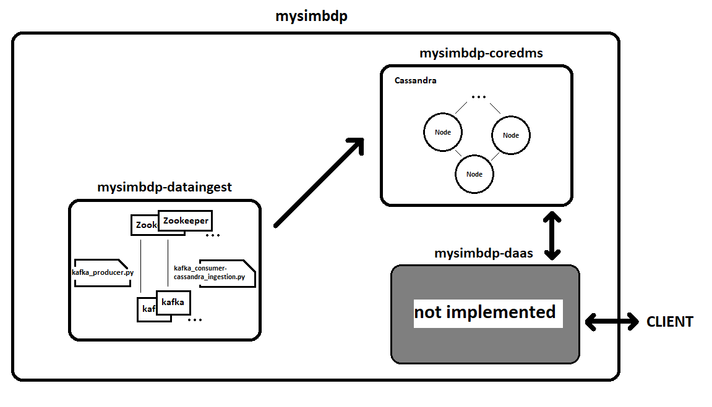
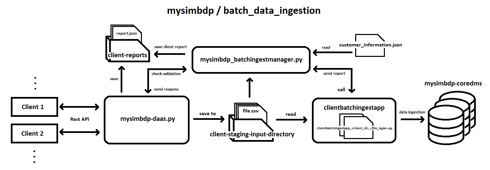
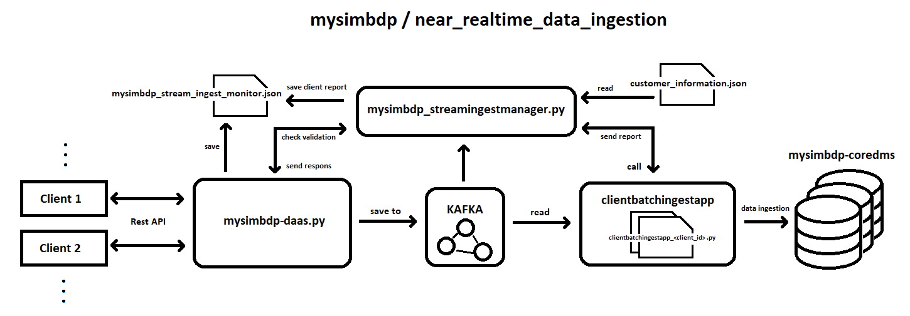
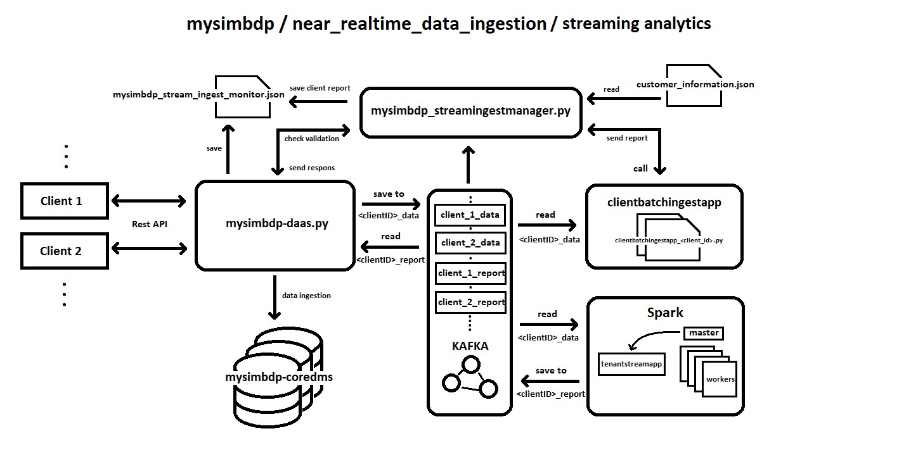

# Simple Big Data Platform

Hi, my name is Shahram Barai, first-year master's student in Computer, Communication, and Information Sciences, specializing in Computer Science: Software Systems and Technologies at Aalto University.

This repository contains assignments for the Big Data Platforms course _(completed in spring 2023)_, where my task was to build a simple big data platform.

## Architecture

The following are the pictures of the evolution of the platform architecture, starting from the first assignment and culminating in the third and final assignment.

For more information about desing and technical issues, check **Assignment*{number}/Reports/Assignment*{number}\_Report.md**

### Assignment 1 (Big Data Platforms):

### Assignment 2 (Data Ingestion Pipelines):

### Architecture 3 (Stream and Batch Processing):

